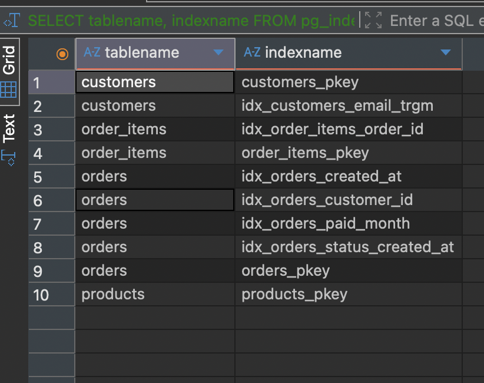

# Tối ưu query PostgreSQL

Sáu query trên bộ dữ liệu 4 triệu dòng. PostgreSQL 17.4 (Docker), DBeaver,
`work_mem` mặc định 4 MB.

## Kết quả

| # | Query | Nguyên nhân | Cách sửa | Trước | Sau | |
|---|---|---|---|---:|---:|---:|
| 1 | [Top 50 đơn `paid`](analysis/q1.md) | Quét 1M dòng rồi sort để lấy 50 | Composite index `(status, created_at DESC)` | 80,6 ms | 0,7 ms | 110× |
| 2 | [Join 3 bảng theo khách](analysis/q2.md) | FK không có index → Hash Join quét 4M dòng | Index `orders.customer_id`, `order_items.order_id` | 232,9 ms | 1,2 ms | 195× |
| 3 | [Doanh thu theo tháng](analysis/q3.md) | Aggregation, không phải I/O: ước lượng số nhóm lệch 10.000× → sort đổ đĩa | Partial covering index (95,4 ms) rồi pre-aggregation bằng materialized view | 133,9 ms | 0,034 ms | 3.937× |
| 4 | [`ILIKE '%...%'`](analysis/q4.md) | B-tree không phục vụ được chuỗi con | GIN + `pg_trgm` | 17,3 ms | 0,8 ms | 22,8× |
| 5 | [Correlated subquery](analysis/q5.md) | Không có vấn đề — index Q2 đã giải quyết | **Không thay đổi gì** | 27,5 ms | — | — |
| 6 | [`date_trunc` trong `WHERE`](analysis/q6.md) | Hàm bọc lên cột → non-sargable | Viết lại thành khoảng + index `created_at` | 40,9 ms | 5,9 ms | 6,9× |

**Chỉ 2 trong 6 bài được sửa bằng cách thêm index cho cột bị thiếu.** Q3 sửa bằng thống
kê, Q4 phải đổi loại index, Q5 không sửa gì, Q6 sửa cách viết query. Tiếp cận cả sáu
bằng cùng một phản xạ "chậm thì thêm index" thì ba bài không được sửa và một bài bị làm
hỏng.

## Cấu trúc

```
sql/00_schema.sql     tạo DB + bảng (không index ngoài PK)
sql/01_seed.sql       sinh dữ liệu + ANALYZE
sql/02_indexes.sql    toàn bộ thay đổi schema, kèm lý do và khối rollback
sql/queries/          query gốc và query đã viết lại
plans/*.txt           EXPLAIN (ANALYZE, BUFFERS) thô, kể cả của phương án thất bại
analysis/qN.md        phân tích từng query
images/               ảnh chụp EXPLAIN trước/sau mỗi thay đổi
```

Plan lưu text để diff được `before`/`after`. `plans/` giữ cả 4 thí nghiệm thất bại của
Q5 — một phương án bị loại sau khi đo có giá trị ngang phương án được chọn.

## Tái lập

1. `sql/00_schema.sql` — phần A trên `postgres`, phần B trên `shop_perf`
2. `sql/01_seed.sql` trên `shop_perf` (vài phút)
3. `sql/99_verify_seed.sql` — kỳ vọng 50.000 / 5.000 / 1.000.000 / 3.000.000
4. Đo baseline, áp `sql/02_indexes.sql`, đo lại

Hai file đầu có khối `DO` kiểm tra `current_database()` và dừng ngay nếu đứng nhầm —
thêm sau khi lần chạy đầu nạp cả 4 triệu dòng vào nhầm database `postgres`.

Dữ liệu sinh bằng `random()` nên số tuyệt đối sẽ lệch; hình dạng plan thì không.

## Cái giá



```
orders (bảng)                   67 MB
  orders_pkey                   21 MB
  idx_orders_status_created_at  32 MB   Q1
  idx_orders_customer_id       7,8 MB   Q2
  idx_orders_paid_created_at   7,8 MB   Q3
  idx_orders_created_at         21 MB   Q6
  tổng index                    90 MB
monthly_paid_revenue            40 kB   Q3, materialized view
```

Mỗi `INSERT` phải cập nhật 5 index, và mọi query trên bảng đều trả thêm thời gian lập
kế hoạch — ở Q2, `Planning Time` chiếm 48% tổng thời gian sau tối ưu. Ở hệ thống ghi
nhiều đọc ít, vài index trong số này không đáng giữ.

`monthly_paid_revenue` cần `REFRESH` (~63 ms) để không lệch dữ liệu. Con số 3.937× của
Q3 chỉ đúng khi đọc nhiều hơn ghi; refresh mỗi lần đọc thì nó chậm hơn cả V2.

## Còn nợ

- Q3 chọn lịch `REFRESH` cho `monthly_paid_revenue` theo mức chấp nhận dữ liệu cũ của
  nghiệp vụ; hiện chưa gắn scheduler.
- `order_items.product_id` chưa có index. Q2 không cần, nhưng `DELETE FROM products` sẽ
  quét toàn bảng để kiểm tra ràng buộc.
- Q6 dùng `SELECT *` nên vẫn tốn 1.219 block đọc bảng.
