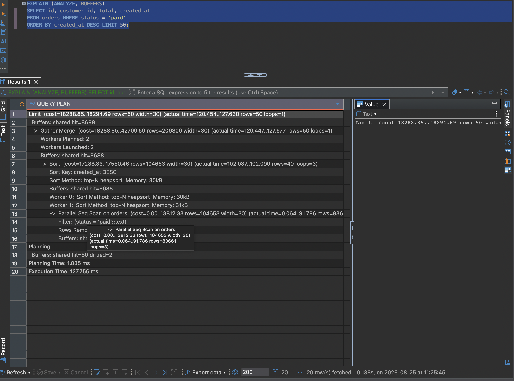
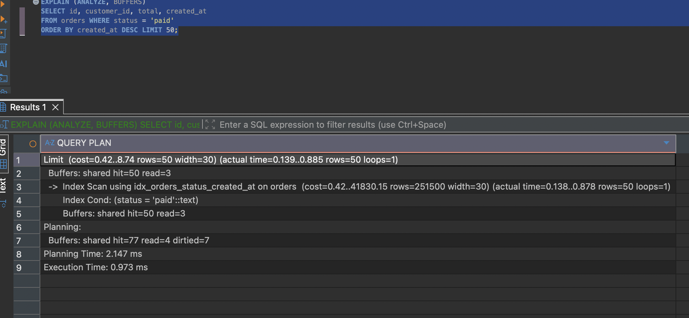

# Q1 — Top 50 đơn `paid` mới nhất

**80,6 ms → 0,7 ms** · 8.678 → 53 block
[`before`](../plans/q1_before.txt) · [`after`](../plans/q1_after.txt)

## Vấn đề

```
Sort  (rows=41 loops=3)  Sort Method: top-N heapsort
  -> Parallel Seq Scan on orders  (rows=83661 loops=3)
       Rows Removed by Filter: 249672
```

- `loops=3` nên phải nhân ba: quét đủ 1.000.000 dòng, giữ 250.983, vứt 749.016 — để lấy 50 dòng.
- `top-N heapsort` chỉ tiết kiệm bộ nhớ (30 kB), không tiết kiệm thời gian. Sort là blocking operator: phải nhận hết đầu vào mới trả được dòng đầu, nên `LIMIT 50` không cắt được gì.
- `Gather Merge` chỉ gộp 50 dòng — thời gian của nó là chi phí khởi động worker, triệu chứng chứ không phải nguyên nhân.



## Sửa

```postgresql
CREATE INDEX idx_orders_status_created_at ON orders (status, created_at DESC);
```

- Cột `=` trước, cột `ORDER BY` sau. `status` gom dữ liệu thành một dải liền mạch, trong dải đó `created_at` giữ nguyên thứ tự nên đọc tuần tự là ra đúng `ORDER BY`, khỏi sort.
- `DESC` không bắt buộc — Postgres quét index ngược được. Viết cho khớp ý định query.

## Kết quả

- Còn đúng một `Index Scan`. `Filter` thành `Index Cond`, `Rows Removed by Filter` biến mất.
- Tổng cost của Index Scan (41998) **không** rẻ hơn Seq Scan (43149). Cải thiện đến từ startup cost gần 0, nên `LIMIT` chỉ trả 0,02% chi phí. Query có `LIMIT` thì startup cost quan trọng hơn total cost.
- `rows=255133` vs `actual rows=50` không phải ước lượng sai — `LIMIT` ngắt node giữa chừng.



## Ghi chú

- Lần đo đầu plan không đổi, `cost` trùng đến từng chữ số → dữ liệu bị nạp nhầm vào database `postgres`. Từ đó luôn xác nhận `SELECT indexname FROM pg_indexes WHERE tablename='...'` trước khi đo lại.
- Giá: index 32 MB, `Planning Time` 0,478 → 1,064 ms cho mọi query trên bảng.
