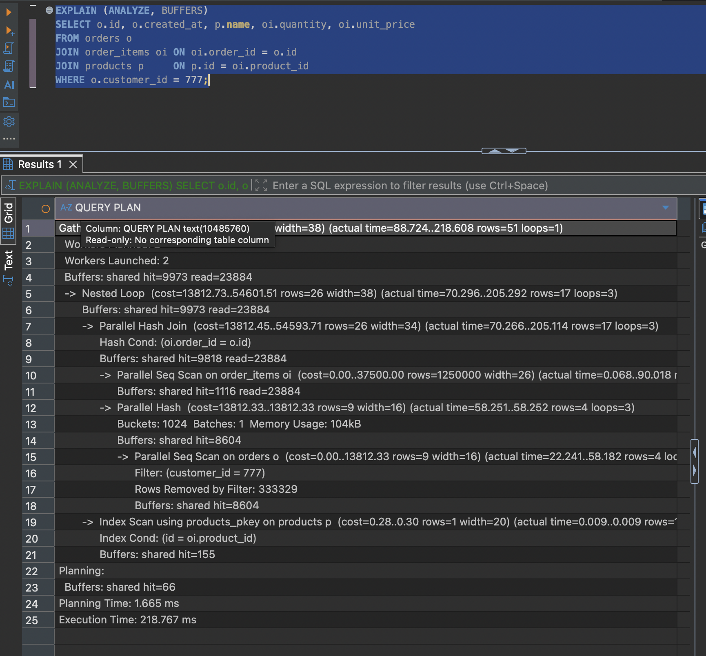
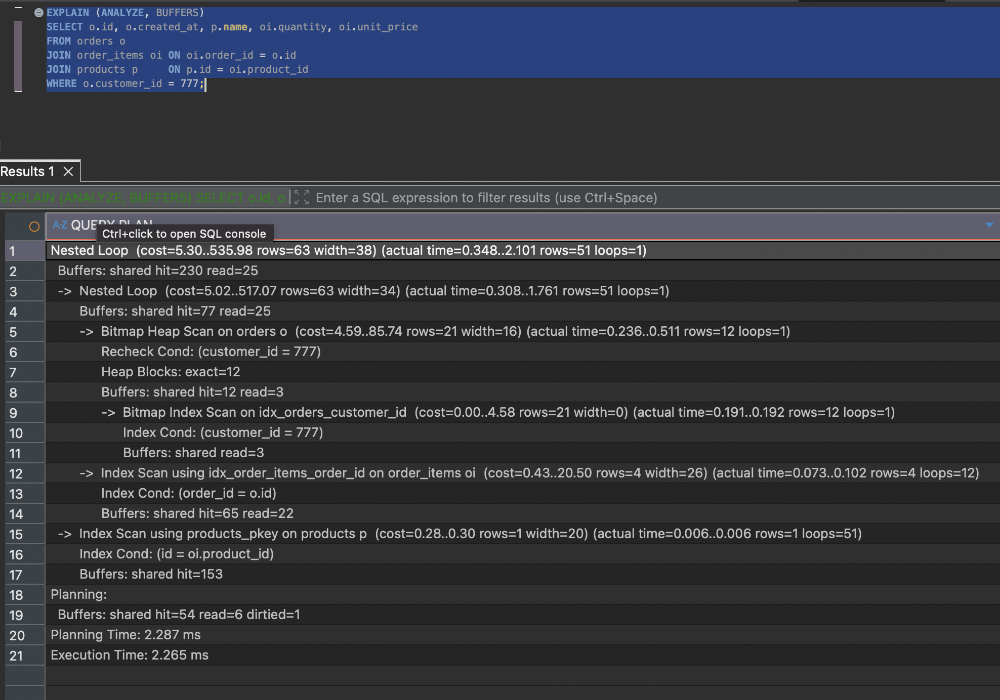

# Q2 — Chi tiết đơn hàng của một khách (join 3 bảng)

**232,9 ms → 1,2 ms** · 33.857 → 255 block
[`before`](../plans/q2_before.txt) · [`after`](../plans/q2_after.txt)

## Vấn đề

Ước lượng: 1M/50k = ~20 đơn mỗi khách, 3M/1M = ~3 items mỗi đơn → kết quả ~60 dòng.
Thực tế 51 dòng, nhưng plan chạm vào 4 triệu dòng.

```
Parallel Hash Join
  -> Parallel Seq Scan on order_items oi  (rows=1000000 loops=3)   -- 3M, không có Filter
  -> Parallel Seq Scan on orders o        (rows=4 loops=3)
       Rows Removed by Filter: 333329                               -- giữ 12, vứt 999.987
```

- `FOREIGN KEY` không tự sinh index ở bảng con (`PRIMARY KEY` thì có). `orders.customer_id` và `order_items.order_id` đều trống.
- Planner chọn Hash Join là đúng: không có index thì Nested Loop phải quét 3M dòng cho mỗi trong 12 đơn = 36 triệu dòng.
- `Index Scan on products_pkey` có `loops=51`, lớn nhất plan, nhưng chỉ tốn 0,56 ms. `loops` lớn không đồng nghĩa với chậm.



## Sửa

```postgresql
CREATE INDEX idx_orders_customer_id   ON orders (customer_id);
CREATE INDEX idx_order_items_order_id ON order_items (order_id);
```

Đơn cột — cả hai chỉ phục vụ một điều kiện `=`, không cần composite như Q1.

## Kết quả

```
Bitmap Heap Scan on orders     rows=12
  -> Index Scan on order_items rows=4  loops=12
       -> Index Scan products  rows=1  loops=51
Buffers: shared hit=255   (hết dòng read)
```

- Chuỗi `loops` khớp số dòng node cha đưa xuống — chữ ký Nested Loop lành mạnh. Loại bệnh thì `loops` hàng nghìn và mỗi vòng là `Seq Scan` (xem Q5).
- Buffers hết dòng `read`: dữ liệu cần ít đi thì vừa nằm gọn trong bộ nhớ đệm.



## Ghi chú

`Planning Time` giờ chiếm 48% tổng thời gian (1,099 / 1,197 ms). Query càng nhanh thì chi
phí lập kế hoạch càng lộ ra — đây là điểm thêm index bừa bãi bắt đầu phản tác dụng.
