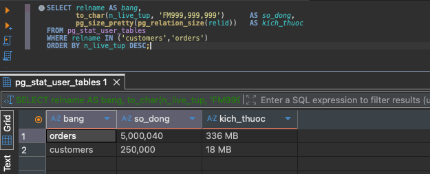
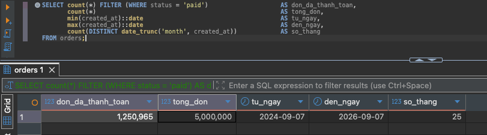
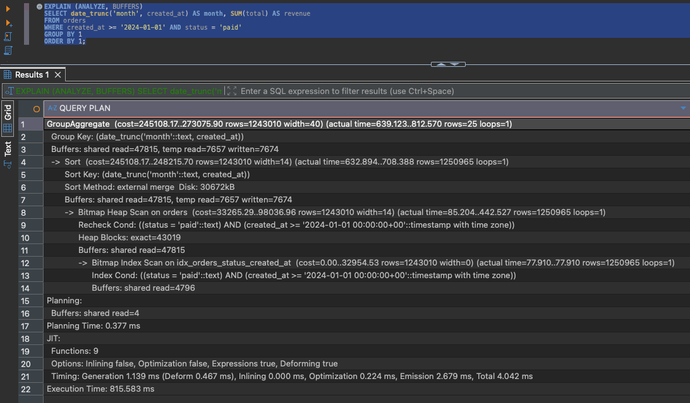
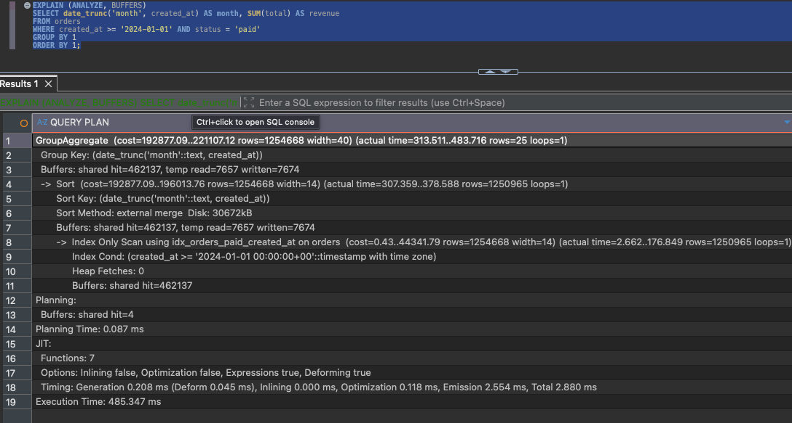
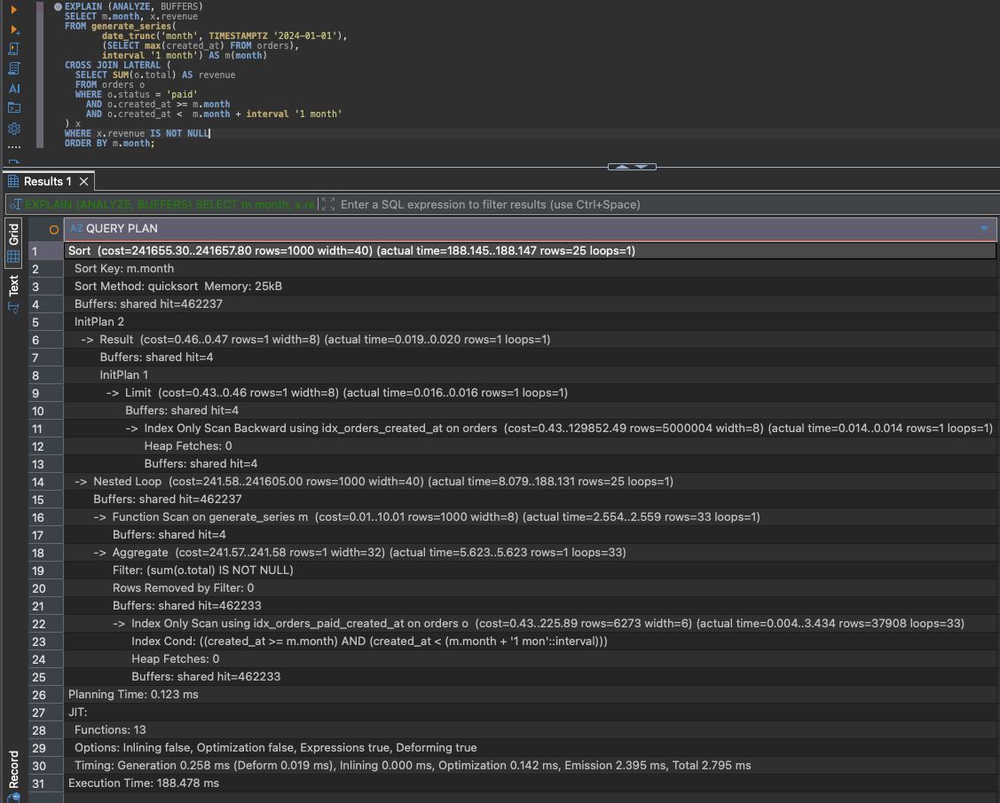
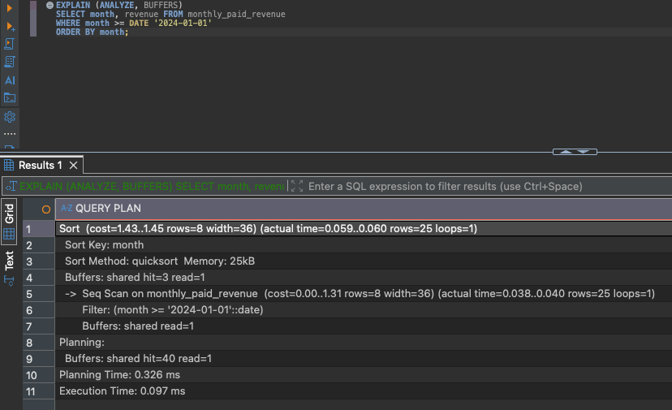
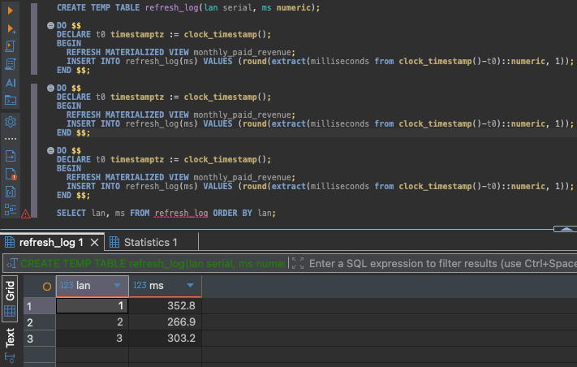
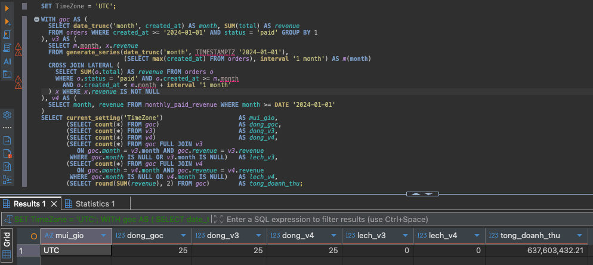
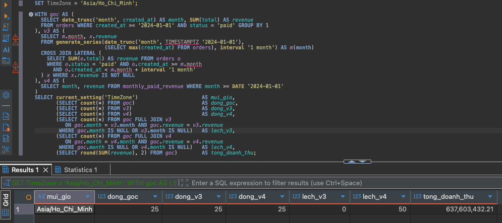

# Q3 — Doanh thu theo tháng

## 1. Đề bài

```sql
SELECT date_trunc('month', created_at) AS month, SUM(total) AS revenue
FROM orders
WHERE created_at >= '2024-01-01' AND status = 'paid'
GROUP BY 1
ORDER BY 1;
```

- Lấy các đơn đã thanh toán, gom theo tháng, mỗi tháng cộng tổng tiền.
- Trả về 25 dòng, ứng với 25 tháng có dữ liệu.
- Phải đọc 250.983 dòng chỉ để tạo ra 25 dòng.
- Yêu cầu thêm: không được dùng `CREATE STATISTICS`, nhưng được sửa câu query.

## 2. Kết quả

| | Cách làm | 1 triệu đơn | 5 triệu đơn | Nhanh hơn V1 |
|---|---|---:|---:|---:|
| V1 | giữ nguyên | 134,768 ms | 797,429 ms | — |
| V2 | thêm index phù hợp hơn | 96,267 ms | 554,479 ms | 1,4 lần |
| V3 | viết lại câu query | 28,791 ms | 204,409 ms | 3,9 lần |
| V4 | tính sẵn kết quả | 0,040 ms | 0,038 ms | 20.985 lần |

- Cột cuối tính trên bộ 5 triệu đơn.
- Mỗi số là trung vị nhiều lần chạy; ảnh chụp là một lần chạy cụ thể nên có thể lệch,
  nhất là lần đầu khi dữ liệu chưa nằm trong bộ nhớ đệm.
- Kế hoạch thực thi đầy đủ:
  [`V1`](../plans/q3_v1_baseline.txt) ·
  [`V2`](../plans/q3_v2_access_path.txt) ·
  [`V3`](../plans/q3_v3_lateral.txt) ·
  [`V4`](../plans/q3_v4_matview.txt) ·
  [`quy mô 5 lần`](../plans/q3_scale_5x.txt) ·
  [`cách đã bỏ`](../plans/q3_alternatives.txt)

## 3. Query gốc chậm ở đâu

```
GroupAggregate  (rows=253033)  (actual rows=25)
  -> Sort  (rows=250983)  Sort Method: external merge  Disk: 6152kB
       -> Bitmap Heap Scan  Heap Blocks: exact=8604
```


- Đọc kế hoạch từ dòng thụt sâu nhất trở lên, vì đó là việc làm trước tiên.
- Ba việc Postgres đã làm:
  1. `Bitmap Heap Scan` — lấy 250.983 dòng ra khỏi bảng, đọc 8.604 khối, đúng bằng
     toàn bộ bảng `orders`.
  2. `Sort` — sắp xếp 250.983 dòng theo tháng.
  3. `GroupAggregate` — duyệt qua, gom nhóm và cộng tiền, ra 25 dòng.
- Thời gian riêng: lấy dữ liệu ~65 ms (49%), sắp xếp ~46 ms (34%), cộng tiền ~21 ms (16%).

### Nguyên nhân 1 — Postgres đoán sai số nhóm

- Dự đoán 253.033 nhóm, thực tế 25 nhóm. Lệch khoảng mười nghìn lần.
- Postgres có hai cách gom nhóm:
  - `HashAggregate` — tạo bảng tra cứu trong bộ nhớ, mỗi tháng một ô, cộng thẳng vào ô.
    Không cần sắp xếp. Với 25 nhóm thì chỉ cần 25 ô nên rất nhẹ.
  - `GroupAggregate` — sắp xếp trước cho các dòng cùng tháng nằm cạnh nhau, rồi duyệt
    một lượt.
- Vì tưởng có 253 nghìn nhóm nên Postgres cho rằng bảng tra cứu sẽ vượt `work_mem`
  (4 MB), bỏ cách thứ nhất, chọn cách thứ hai.
- Sắp xếp 250.983 dòng cũng vượt 4 MB, nên phải ghi tạm xuống ổ cứng rồi đọc lên:
  dòng `Sort Method: external merge  Disk: 6152kB`. Đây là thao tác chậm nhất.
- Vì sao đoán sai: Postgres có thống kê cho **cột** `created_at`, nhưng query gom nhóm
  theo `date_trunc('month', created_at)` — kết quả của một **hàm**. Postgres không thu
  thập thống kê cho kết quả của hàm, nên đoán số nhóm xấp xỉ số dòng.

### Nguyên nhân 2 — đọc quá nhiều dữ liệu

- `Heap Blocks: exact=8604` nghĩa là đọc gần hết bảng dù đã có index.
- Điều kiện lọc không đủ hẹp: `status = 'paid'` khớp 25,1% số dòng, nên khối nào cũng
  chứa ít nhất một dòng cần lấy.
- Index cũ `(status, created_at)` không chứa cột `total`, mà query cần cột này để cộng
  tiền, nên vẫn phải quay về bảng gốc lấy.
- Chi tiết phụ: `created_at >= '2024-01-01'` không loại bỏ dòng nào, vì dữ liệu bắt đầu
  từ 2024-08-25. Query trông như lọc theo thời gian nhưng thực chất chỉ lọc theo trạng
  thái đơn hàng.

## 4. Cách 1 (V2) — thêm index phù hợp hơn

```sql
CREATE INDEX idx_orders_paid_created_at
    ON orders (created_at)
    INCLUDE (total)
    WHERE status = 'paid';
```

- Không đụng câu query, không đụng cấu trúc bảng.
- `WHERE status = 'paid'` làm index chỉ chứa dòng đã thanh toán. Gọi là *partial index*.
  Chỉ chứa ~25% số dòng nên nặng 7744 kB, so với 41 MB nếu làm index đầy đủ.
- `INCLUDE (total)` nhét thêm cột `total` vào index, không để tìm kiếm mà để đọc kèm.
  Gọi là *covering index*. Nhờ vậy không phải quay về bảng gốc.
- Dấu hiệu xác nhận: dòng `Heap Fetches: 0` trong kế hoạch thực thi.

| | V1 | V2 |
|---|---:|---:|
| Số khối dữ liệu đọc | 9.571 | 968 |
| Số lần quay về bảng gốc | — | 0 |
| Thời gian lấy dữ liệu | ~65 ms | ~35 ms |
| Sắp xếp | ghi tạm 6152 kB xuống ổ | vẫn ghi tạm 6152 kB xuống ổ |
| Dự đoán số nhóm | 253.033 so với 25 | vẫn lệch như cũ |


- Đọc ít hơn 9,9 lần nhưng chỉ nhanh hơn 1,40 lần.
- Lý do: index chỉ chữa được nguyên nhân 2. Nguyên nhân 1 vẫn còn nguyên.
- Sau V2, riêng sắp xếp và cộng tiền chiếm 60 trong 96 ms.
- **Không index nào chữa được nguyên nhân 1**, vì đó là vấn đề về cách Postgres ước
  lượng, không phải cách tìm dữ liệu.

## 5. Cách 2 (V3) — viết lại câu query

- Ý tưởng: nếu Postgres không đoán được `GROUP BY date_trunc(...)` ra bao nhiêu nhóm,
  thì bỏ luôn `GROUP BY` đó.
- Thay vì đưa 250.983 dòng rồi bảo nó tự tìm có bao nhiêu tháng, ta nói thẳng danh sách
  các tháng, rồi với mỗi tháng bảo nó cộng riêng.

```sql
SELECT m.month, x.revenue
FROM generate_series(
       date_trunc('month', TIMESTAMPTZ '2024-01-01'),
       (SELECT max(created_at) FROM orders),
       interval '1 month') AS m(month)
CROSS JOIN LATERAL (
  SELECT SUM(o.total) AS revenue
  FROM orders o
  WHERE o.status = 'paid'
    AND o.created_at >= m.month
    AND o.created_at <  m.month + interval '1 month'
) x
WHERE x.revenue IS NOT NULL
ORDER BY m.month;
```

Giải thích từng phần:

- `generate_series(...)` — hàm sinh dãy giá trị. Ở đây sinh dãy mốc đầu tháng:
  `2024-01-01`, `2024-02-01`, `2024-03-01`, và cứ thế đến tháng của đơn mới nhất.
- `CROSS JOIN LATERAL (...)` — với **mỗi** giá trị bên trái, chạy câu lệnh trong ngoặc
  một lần.
- `LATERAL` — từ khoá cho phép câu lệnh bên trong nhìn thấy và dùng `m.month` từ bên
  ngoài. Không có nó thì Postgres không cho tham chiếu như vậy.
- Câu bên trong chỉ cộng tiền các đơn trong đúng một tháng. Nhanh vì các đơn cùng tháng
  nằm liền nhau trong index của V2.
- `WHERE x.revenue IS NOT NULL` — bỏ những tháng không có đơn nào, để khớp query gốc.


```
Nested Loop  (actual time=0.865..43.791 rows=25 loops=1)
  -> Function Scan on generate_series m  (rows=32 loops=1)
  -> Aggregate  (rows=1 loops=32)
       -> Index Only Scan using idx_orders_paid_created_at  (rows=7843 loops=32)
            Heap Fetches: 0
```

- Không còn `Sort` trên 250.983 dòng, không còn ghi tạm xuống ổ cứng.
- `loops=32` — phần cộng tiền chạy 32 lần, mỗi lần một tháng. Bảy tháng đầu không có
  dữ liệu nên bị `WHERE x.revenue IS NOT NULL` loại.
- Ưu điểm: chỉ đổi câu query, dùng lại đúng index của V2, không thêm gì phải vận hành,
  dữ liệu vẫn luôn mới nhất.

## 6. Cách 3 (V4) — tính sẵn kết quả

```sql
CREATE MATERIALIZED VIEW monthly_paid_revenue AS
SELECT (date_trunc('month', created_at AT TIME ZONE 'UTC'))::date AS month,
       SUM(total) AS revenue
FROM orders WHERE status = 'paid'
GROUP BY 1;

CREATE UNIQUE INDEX idx_monthly_paid_revenue_month ON monthly_paid_revenue (month);
```

```sql
SELECT month, revenue FROM monthly_paid_revenue
WHERE month >= DATE '2024-01-01' ORDER BY month;
```

- `MATERIALIZED VIEW` là **một bảng thật, chứa sẵn kết quả đã tính xong**.
- 250.983 dòng đã gộp thành 25 dòng, nặng 40 kB.
- Chỉ mất 0,040 ms vì không còn phải lấy dữ liệu, sắp xếp hay cộng. Mọi việc đã làm từ
  trước.


### Cái giá phải trả

- Đây chỉ là bản chụp tại một thời điểm. Có đơn mới vào `orders` thì bảng này **không
  tự cập nhật**.
- Muốn cập nhật phải chạy `REFRESH MATERIALIZED VIEW monthly_paid_revenue;`

| | |
|---|---:|
| Tạo lần đầu | 108,8 ms |
| Mỗi lần `REFRESH` | 57–61 ms |
| Mỗi lần đọc | 0,040 ms |
| Dung lượng | 40 kB |


- Một lần `REFRESH` còn rẻ hơn một lần chạy query gốc, và cũng dùng index của V2.
- Con số "nhanh hơn hàng nghìn lần" chỉ đúng khi đọc nhiều hơn hẳn cập nhật:

| Tình huống | Tổng thời gian |
|---|---|
| Cập nhật 1 lần rồi đọc 100 lần | 60 + 100 × 0,04 = 64 ms, rất đáng |
| Cập nhật 1 lần rồi đọc 1 lần | 60 ms, ngang V3 |
| Cập nhật lại mỗi lần đọc | 60 ms mỗi lần, chậm hơn V3 |

- Hợp với báo cáo hoặc màn hình thống kê (ít cập nhật, đọc nhiều).
- Không hợp với chỗ cần số liệu chính xác đến từng giây.

## 7. Kiểm tra ba cách có cho cùng kết quả không

```
                          dong_goc  dong_v3  dong_v4  lech_v3  lech_v4
Etc/UTC                        25       25       25        0        0
Asia/Ho_Chi_Minh               25       25       25        0       50
tổng doanh thu: 128.073.158,73
```


- Ở múi giờ UTC: cả hai cách khớp hoàn toàn với query gốc.
- Ở giờ Việt Nam: V4 lệch toàn bộ 50 dòng, V3 vẫn đúng.
- Nguyên nhân:
  - Cột `created_at` kiểu `TIMESTAMPTZ`, tức mốc thời gian có kèm múi giờ.
  - `date_trunc('month', created_at)` tính tháng theo múi giờ của người chạy query.
  - Ví dụ đơn đặt lúc `2024-08-31 20:00` giờ UTC: người ở UTC thấy thuộc tháng 8, người
    ở Việt Nam thấy là `2024-09-01 03:00` nên thuộc tháng 9.
  - Cùng một đơn, cùng một query, hai người ở hai nơi ra hai tháng khác nhau.
- V4 viết `AT TIME ZONE 'UTC'` để chốt cứng, nên kết quả luôn giống nhau nhưng không
  còn khớp query gốc khi chạy ở múi giờ khác. Muốn chốt theo giờ Việt Nam thì đổi
  `'UTC'` thành `'Asia/Ho_Chi_Minh'` rồi `REFRESH` lại.
- V3 không gặp vấn đề này vì vẫn tính theo múi giờ của phiên làm việc, y hệt query gốc.
- Cùng họ vấn đề với Q6: `date_trunc` nhận `TIMESTAMPTZ` được Postgres xếp loại `STABLE`
  chứ không `IMMUTABLE`, nghĩa là kết quả có thể thay đổi tuỳ hoàn cảnh.

## 8. Kiểm tra lại ở quy mô gấp 5 lần

- Ở bộ 1 triệu đơn, khoảng cách giữa các cách chưa đủ rõ để yên tâm kết luận.
- Dựng database riêng: 250.000 khách, 5 triệu đơn, trong đó 1.250.965 đơn đã thanh toán.
- Script dựng ở [`sql/03_scale_test.sql`](../sql/03_scale_test.sql), số liệu ở
  [`plans/q3_scale_5x.txt`](../plans/q3_scale_5x.txt).





| | 1 triệu đơn | 5 triệu đơn | Chậm đi bao nhiêu |
|---|---:|---:|---:|
| V1 | 134,768 ms | 797,429 ms | 5,9 lần |
| V2 | 96,267 ms | 554,479 ms | 5,8 lần |
| V3 | 28,791 ms | 204,409 ms | 7,1 lần |
| V4 | 0,040 ms | 0,038 ms | không đổi |
| `REFRESH` của V4 | 57–61 ms | 267–364 ms | khoảng 5 lần |









Hai điều rút ra:

- **V4 là cách duy nhất không bị ảnh hưởng bởi lượng dữ liệu**, vì luôn chỉ đọc 25 dòng
  đã tính sẵn. Ba cách kia đều chậm đi gần đúng tỉ lệ dữ liệu tăng.
- Nhưng chi phí `REFRESH` cũng tăng theo đúng tỉ lệ đó. **Cái giá không mất đi, nó chỉ
  chuyển từ lúc đọc sang lúc cập nhật.**



- Thứ hạng giữa các cách không đổi: V3 vẫn nhanh hơn V2 khoảng 2,7 lần ở bộ lớn so với
  3,3 lần ở bộ nhỏ. Kết luận chọn V3 không phụ thuộc quy mô.
- Kết quả vẫn đúng ở quy mô lớn: 25 dòng, không dòng nào lệch, tổng doanh thu
  637.603.432,21. V4 vẫn lệch 50 dòng ở giờ Việt Nam.





## 9. Chọn cách nào

| | V2 | V3 | V4 |
|---|---|---|---|
| Thời gian (5 triệu đơn) | 554 ms | 204 ms | 0,038 ms |
| Phải sửa câu query | không | có | có |
| Thêm gì vào database | index 7,7 MB | dùng lại index của V2 | bảng tính sẵn 40 kB |
| Phải vận hành thêm | không | không | lịch cập nhật định kỳ |
| Dữ liệu mới nhất | có | có | cũ theo chu kỳ cập nhật |
| Chạy ở múi giờ khác | đúng | đúng | chỉ đúng ở UTC |

- **Chọn V3 làm phương án chính**, vì:
  - Nhanh hơn 3,9 lần ở bộ 5 triệu đơn.
  - Không thêm gì phải vận hành.
  - Dữ liệu luôn mới nhất.
  - Chạy ở múi giờ nào cũng đúng.
  - Chỉ cần viết lại câu query cộng index đã có từ V2.
- Giữ V4 làm lựa chọn cho màn hình báo cáo, nếu chấp nhận dữ liệu cũ vài phút.
- Khi dùng V4 nên chạy `REFRESH MATERIALIZED VIEW CONCURRENTLY` thay vì `REFRESH`
  thường, vì bản `CONCURRENTLY` không khoá bảng nên người dùng vẫn đọc được trong lúc
  cập nhật. Đổi lại chậm hơn một chút và bắt buộc phải có index `UNIQUE` — đã tạo sẵn.

## 10. Hai cách đã thử nhưng bỏ

Chi tiết ở [`plans/q3_alternatives.txt`](../plans/q3_alternatives.txt).

### Dùng CREATE STATISTICS — 20,594 ms

- Đây chính là cách đã dùng ở lần làm trước (PR #1).


```sql
CREATE STATISTICS stat_orders_month ON (date_trunc('month', created_at)) FROM orders;
ANALYZE orders;   -- CREATE STATISTICS chỉ khai báo, phải ANALYZE mới thu thập thật
```

- Lệnh này bảo Postgres thu thập thống kê cho cả kết quả của hàm, không chỉ cho cột.
- Sau đó Postgres biết `date_trunc('month', created_at)` chỉ có 25 giá trị, nên chọn
  `HashAggregate` và không cần sắp xếp nữa. Xử lý thẳng nguyên nhân 1 mà không đụng query.
- Số liệu lần làm trước: 153,4 ms xuống 21,4 ms. Tách được từng phần: riêng
  `CREATE STATISTICS` đưa xuống 40,8 ms (3,8 lần), rồi covering index đưa tiếp xuống
  21,4 ms (thêm 1,9 lần). Phần lớn cải thiện đến từ sửa thông tin cho Postgres.
- Bản đo gốc:
  [`trước khi tối ưu`](../plans/q3_pr1_before.txt) ·
  [`chỉ thêm thống kê`](../plans/q3_pr1_stage1_stats_only.txt) ·
  [`thêm cả covering index`](../plans/q3_pr1_after.txt)


- Lưu ý khi đọc: con số 20,594 ms **không phải** đo lại đúng cấu hình cũ. Lần trước chạy
  kèm index `idx_orders_paid_month` 41 MB, lần này chạy kèm partial index 7744 kB của
  V2. Ba file trên cũng đo ở trạng thái bảng khác (chưa `VACUUM FULL`, baseline 153,4 ms
  thay vì 134,8 ms) nên chỉ đọc để tham khảo cách làm.
- Đây là cách nhanh nhất trong các cách giữ được dữ liệu mới nhất, và không phải sửa
  query. Bỏ chỉ vì đề bài yêu cầu không dùng, không phải vì nó dở.

### Thêm một cột tính sẵn vào bảng — 33,941 ms

```sql
ALTER TABLE orders ADD COLUMN created_month date
  GENERATED ALWAYS AS ((date_trunc('month', created_at AT TIME ZONE 'UTC'))::date) STORED;
```

- Biến kết quả của hàm thành cột thật, để Postgres tự thu thập thống kê như mọi cột khác.
- Cũng sửa được nguyên nhân 1 mà không cần `CREATE STATISTICS`.
- Bỏ vì cái giá quá đắt:
  - `ALTER TABLE` viết lại toàn bộ bảng, mất 2,2 giây, giữ khoá `ACCESS EXCLUSIVE` suốt
    thời gian đó. Hệ thống thật sẽ chết trong 2,2 giây.
  - Bảng phình từ 67 lên 75 MB, không đòi lại được nếu sau này bỏ cột.
  - Vẫn chậm hơn V3, và cũng chốt cứng múi giờ UTC nên gặp đúng vấn đề như V4.

## 11. Một sự cố gặp trong lúc đo

- Đang đo dở thì chạy `VACUUM FULL orders` để thu hồi dung lượng thừa.
- Ngay sau đó V2 mất sạch tác dụng: kế hoạch tụt từ `Index Only Scan` về
  `Bitmap Heap Scan`, đọc lại đủ 8.604 khối, thời gian gần bằng lúc chưa tối ưu.
- Nguyên nhân: `VACUUM FULL` viết lại toàn bộ bảng và xoá sạch *visibility map* — bản đồ
  đánh dấu những khối mà mọi dòng bên trong đều đã ổn định. `Index Only Scan` cần bản đồ
  này để biết khối nào tin tưởng được mà đọc thẳng từ index.
- Cách khắc phục: chạy `VACUUM` thường (không phải `FULL`) để dựng lại bản đồ.

```
VACUUM (ANALYZE) orders;
SELECT relallvisible, relpages FROM pg_class WHERE relname='orders';   -->  8604 / 8604
```


- Hai con số bằng nhau nghĩa là toàn bộ khối đã được đánh dấu ổn định.

## 12. Những gì tôi rút ra

- Không phải cứ chậm là thiếu index. Ở bài này index đã có sẵn và đã được dùng, mà query
  vẫn chậm hơn cả lúc chưa có index nào.
- Một câu query chậm có thể do nhiều nguyên nhân độc lập. Phải tách ra và sửa riêng,
  đừng gộp làm một.
- `EXPLAIN` cho biết Postgres **dự đoán** bao nhiêu dòng và **thực tế** bao nhiêu dòng.
  Hai con số lệch xa nhau là dấu hiệu Postgres đang chọn sai chiến lược.
- Postgres chỉ thu thập thống kê cho cột, không cho kết quả của hàm. Đây là điểm mù cần
  nhớ khi viết `GROUP BY` có hàm.
- Tối ưu không chỉ có index. Sửa câu query, hoặc đổi cách lưu dữ liệu, đều là cách tối ưu.
- Mọi cách tối ưu đều có giá. `MATERIALIZED VIEW` nhanh nhất nhưng đổi lại dữ liệu không
  còn mới nhất và phải có lịch cập nhật.
- Phải kiểm tra kết quả sau khi tối ưu có giống trước không. Nếu không kiểm tra thì đã
  không phát hiện chuyện V4 lệch ở múi giờ Việt Nam.
- Nên đo ở nhiều quy mô dữ liệu. Bộ nhỏ không cho thấy được đặc điểm quan trọng nhất của
  V4 là thời gian không đổi khi dữ liệu tăng.
