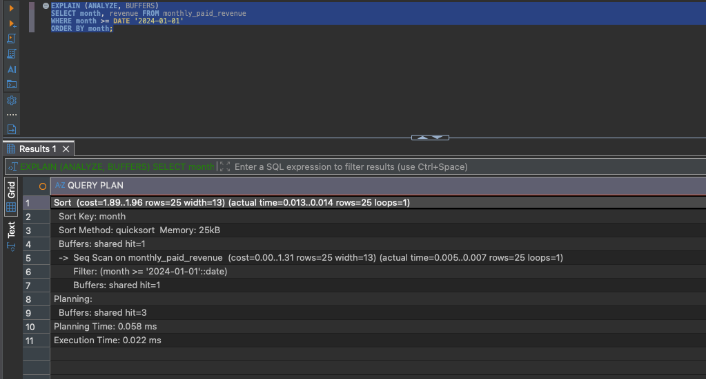

# Q3 — Doanh thu theo tháng

| | Kỹ thuật | Thời gian | So với V1 |
|---|---|---:|---:|
| V1 | không | 133,862 ms | — |
| V2 | partial covering index | 95,443 ms | 1,40× |
| V3 | materialized view | 0,034 ms | 3.937× |

Plan: [`V1`](../plans/q3_v1_baseline.txt) · [`V2`](../plans/q3_v2_partial_index.txt) · [`V3`](../plans/q3_v3_matview.txt) · [`phương án đã loại`](../plans/q3_alternatives.txt)

Median 5 lần chạy nóng, cùng một trạng thái bảng cho mọi phép đo: `orders` 67 MB,
visibility map 100% all-visible, `work_mem` 4 MB, TimeZone `Etc/UTC`.

Index cần thiết đã có sẵn từ Q1 và planner đã dùng, mà query vẫn chậm hơn cả Q1 lúc
chưa có index nào.

## Bottleneck

```
GroupAggregate  (rows=253033)  (actual rows=25)          <-- lệch 10.000 lần
  -> Sort  (rows=250983)  Sort Method: external merge  Disk: 6152kB
       -> Bitmap Heap Scan  Heap Blocks: exact=8604      <-- đọc gần hết bảng
```


Phân rã: scan ~65 ms (49%), sort ~46 ms (34%), aggregate ~21 ms (16%). Hai vấn đề độc
lập, phải sửa riêng.

**Aggregation.** Ước lượng 253.033 nhóm, thực tế 25. Postgres chỉ thu thập thống kê cho
cột, không cho biểu thức, nên với `GROUP BY date_trunc('month', created_at)` nó đoán số
nhóm xấp xỉ số dòng. Vì tưởng có 253 nghìn nhóm nên nó loại `HashAggregate`, buộc phải
`Sort` đủ 250.983 dòng, vượt `work_mem` 4 MB và đổ ra đĩa.

**I/O.** `created_at >= '2024-01-01'` không lọc bỏ dòng nào vì dữ liệu bắt đầu từ
2024-08-25, nên `WHERE` khớp 25,1% bảng. Index cũ `(status, created_at)` vẫn phải vào
heap lấy cột `total`, đọc đủ 8.604 block.

## V2 — Partial covering index

```sql
CREATE INDEX idx_orders_paid_created_at
    ON orders (created_at)
    INCLUDE (total)
    WHERE status = 'paid';
```

Query giữ nguyên, không đổi schema hay application logic.

`WHERE status = 'paid'` khiến index chỉ chứa ~25% số dòng nên nặng 7744 kB, so với
41 MB của covering index đầy đủ trên `(status, created_at)`. `INCLUDE (total)` đưa nốt
cột cần cộng vào index để có Index Only Scan, xác nhận bằng `Heap Fetches: 0`.

| | V1 | V2 |
|---|---:|---:|
| Buffers (shared) | 9.571 | 968 |
| Heap Fetches | — | 0 |
| Scan | ~65 ms | ~35 ms |
| Sort | external merge 6152 kB | vẫn 6152 kB |
| Ước lượng nhóm | 253.033 vs 25 | vẫn 250.500 vs 25 |


V2 chỉ giải quyết được phần I/O. Sort và ước lượng sai còn nguyên, và sau V2 thì sort +
aggregate chiếm 60/95 ms. Nút thắt chuyển từ I/O sang aggregation, chỗ mà index không
với tới được.

## V3 — Materialized view

```sql
CREATE MATERIALIZED VIEW monthly_paid_revenue AS
SELECT (date_trunc('month', created_at AT TIME ZONE 'UTC'))::date AS month,
       SUM(total) AS revenue
FROM orders WHERE status = 'paid'
GROUP BY 1;

CREATE UNIQUE INDEX idx_monthly_paid_revenue_month ON monthly_paid_revenue (month);
```

```sql
SELECT month, revenue FROM monthly_paid_revenue
WHERE month >= DATE '2024-01-01' ORDER BY month;
```

250.983 dòng được gộp sẵn thành 25 dòng, 40 kB. Không còn tối ưu đường truy cập nữa mà
bỏ hẳn việc aggregate lúc chạy query.

```
Sort  (actual time=0.017..0.018 rows=25 loops=1)   Sort Method: quicksort  Memory: 25kB
  -> Seq Scan on monthly_paid_revenue  (actual time=0.003..0.005 rows=25 loops=1)
Buffers: shared hit=4
```



Seq Scan ở đây là hợp lý, quét một bảng 25 dòng thì không index nào rẻ hơn.

### Chi phí

| | |
|---|---:|
| Build lần đầu | 108,8 ms |
| `REFRESH` | 60–67 ms |
| Query | 0,034 ms |
| Dung lượng | 40 kB |


`REFRESH` rẻ hơn một lần chạy query gốc (133,9 ms), và bản thân nó cũng dùng partial
index của V2.

Con số 3.937× chỉ đúng nếu đọc nhiều hơn ghi. Với 1 refresh + 1 query thì tổng vẫn là
~63 ms, còn nếu refresh mỗi lần đọc thì V3 chậm hơn V2.

### Kiểm chứng tương đương

```
session Etc/UTC:            25 dòng / 25 dòng / 0 dòng lệch
tổng revenue:               128.073.158,73 / 128.073.158,73
session Asia/Ho_Chi_Minh:   50 dòng lệch
```


Ở UTC thì khớp tuyệt đối. Ở `Asia/Ho_Chi_Minh` thì cả 25 dòng mỗi bên đều không khớp,
vì `date_trunc('month', created_at)` trong query gốc dùng TimeZone của session nên cùng
một dòng rơi vào tháng khác nhau tuỳ ai chạy.

Matview chốt cứng `'UTC'` cho kết quả xác định. Nếu nghiệp vụ cần chốt theo giờ Việt
Nam thì đổi `'UTC'` thành `'Asia/Ho_Chi_Minh'` trong định nghĩa view rồi refresh lại.

Cùng họ vấn đề với Q6: `date_trunc(text, timestamptz)` là `STABLE` chứ không `IMMUTABLE`.

## Trade-off

| | V2 | V3 |
|---|---|---|
| Query | 95,4 ms | 0,034 ms |
| Dữ liệu | realtime | cũ tối đa bằng chu kỳ refresh |
| Thay đổi query | không | có |
| Thay đổi schema | thêm index 7,7 MB | thêm matview 40 kB |
| Chi phí ghi | mọi INSERT `paid` cập nhật thêm index | refresh định kỳ ~63 ms |
| Múi giờ | theo session | chốt UTC |

Giữ cả hai. V2 cho truy vấn ad-hoc và cho khoảng thời gian matview chưa gộp, V3 cho
dashboard. `REFRESH ... CONCURRENTLY` không khoá đọc (cần UNIQUE index, đã tạo) nhưng
chậm hơn refresh thường.

Nếu chịu được dữ liệu cũ vài phút thì refresh mỗi 5–15 phút là đủ. Cần realtime tuyệt
đối thì dừng ở V2.

## Hai phương án đã đo rồi loại

Chi tiết: [`plans/q3_alternatives.txt`](../plans/q3_alternatives.txt)


**`CREATE STATISTICS` trên biểu thức — 20,7 ms.** Sửa đúng phần aggregation: ước lượng
về 25, `HashAggregate` được chọn, hết sort và hết đổ đĩa. Nhanh hơn V2 gần 5 lần và giữ
được realtime. Loại vì ràng buộc đề bài, không phải vì kém.

**Cột generated — 33,6 ms.**

```sql
ALTER TABLE orders ADD COLUMN created_month date
  GENERATED ALWAYS AS ((date_trunc('month', created_at AT TIME ZONE 'UTC'))::date) STORED;
```

Biến biểu thức thành cột thật để Postgres thu thập `n_distinct` như cột thường, đo được
đúng 25 mà không cần `CREATE STATISTICS`. Loại vì:

- `ALTER TABLE` rewrite toàn bảng mất 3,9 giây và giữ `ACCESS EXCLUSIVE` lock suốt thời
  gian đó.
- Bảng phình 67 lên 75 MB, và `DROP COLUMN` không thu hồi lại được, phải `VACUUM FULL`
  thêm một lần khoá bảng nữa.
- Chậm hơn V3 khoảng 1.000 lần cho đúng workload báo cáo mà nó nhắm tới.

Sau khi ước lượng đã đúng, planner bỏ hết index và chọn `Parallel Seq Scan`. Ép dùng
index bằng `enable_seqscan=off` cho 87,6 ms.

## Bẫy gặp trong lúc đo

Sau khi `VACUUM FULL orders` để thu hồi dung lượng, V2 mất hết tác dụng: plan rơi từ
`Index Only Scan` về `Bitmap Heap Scan` đọc đủ 8.604 block, thời gian gần bằng V1.

`VACUUM FULL` viết lại toàn bộ bảng và xoá sạch visibility map. Index Only Scan cần map
này để biết block nào đã all-visible, không có thì mọi dòng đều phải kiểm tra ở heap.

```
VACUUM (ANALYZE) orders;
SELECT relallvisible, relpages FROM pg_class WHERE relname='orders';   -->  8604 / 8604
```


Chạy `VACUUM` thường xong thì Index Only Scan hoạt động lại. Kiểm tra `Heap Fetches`
trước khi kết luận một covering index là vô dụng.
