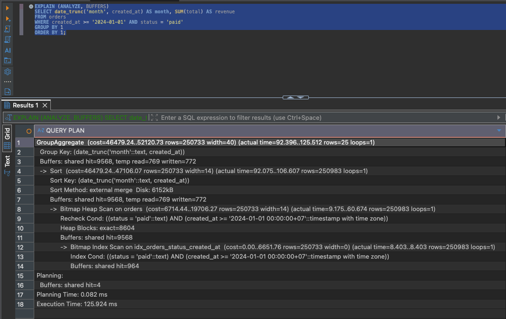
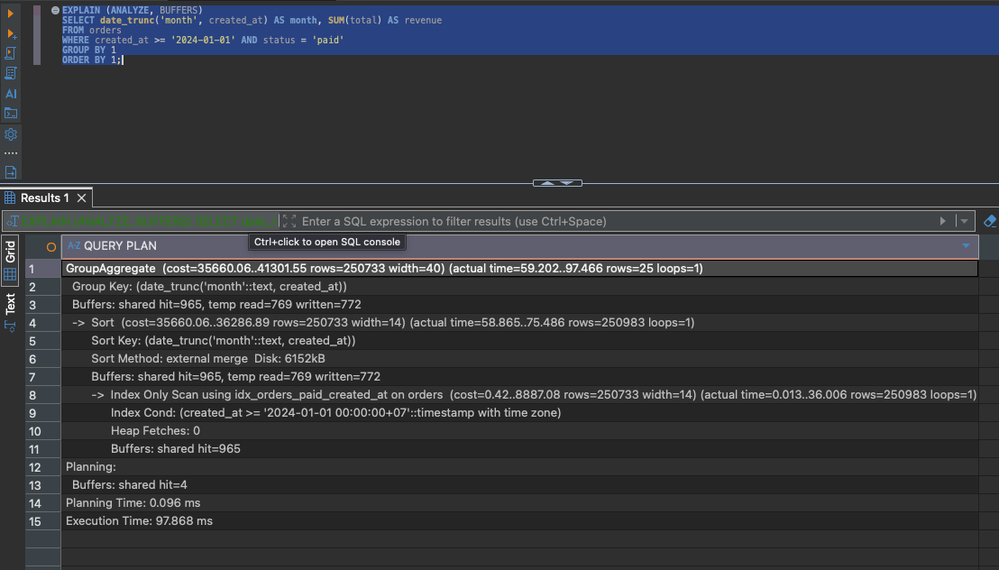
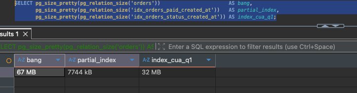
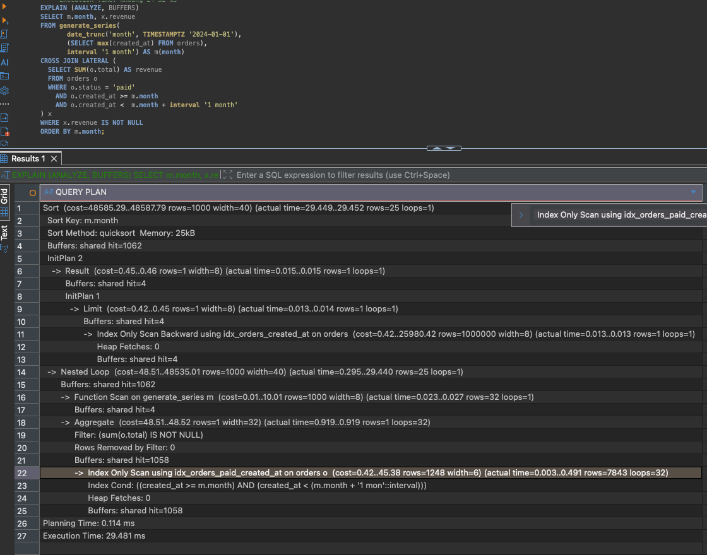
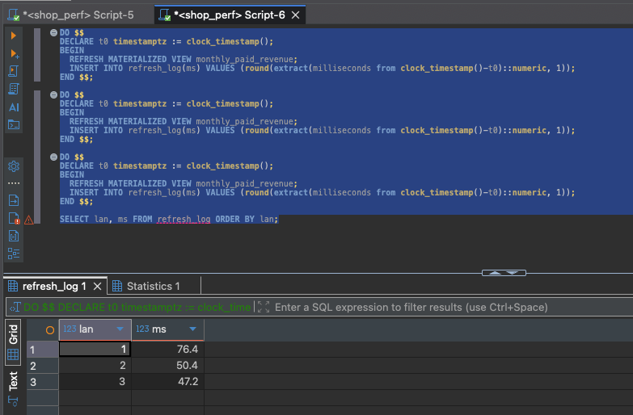
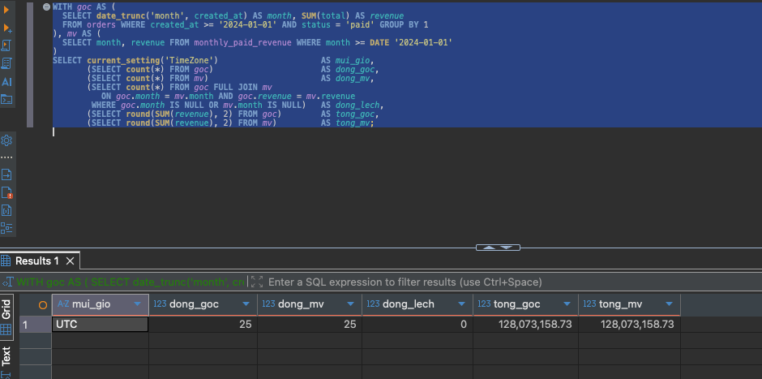
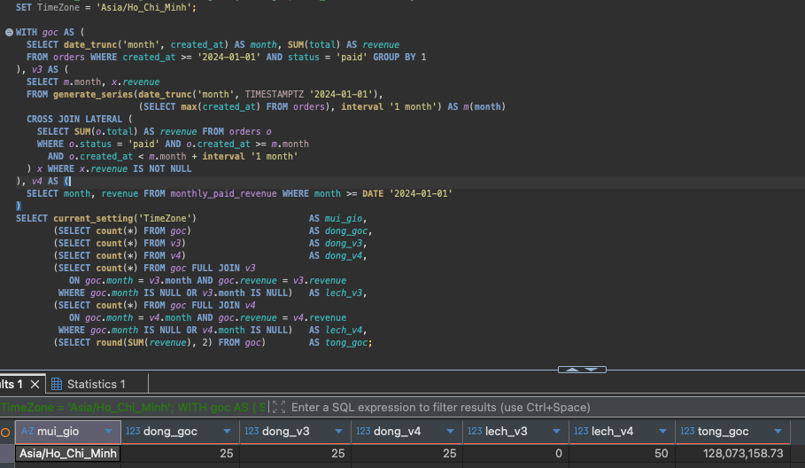
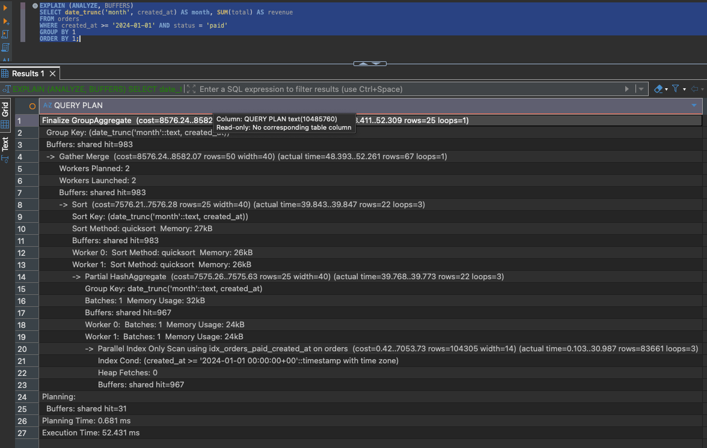
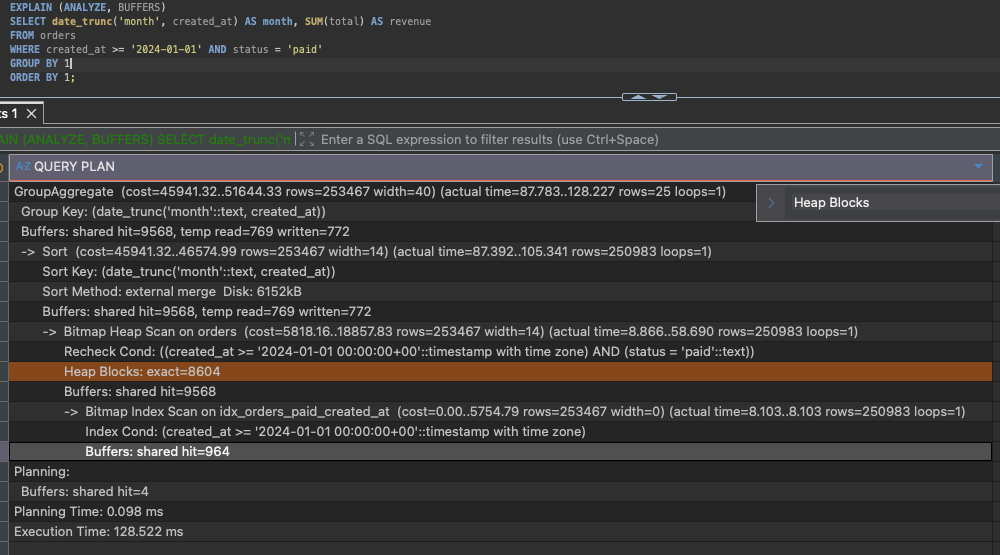

# Q3 — Doanh thu theo tháng

Câu query cần tối ưu:

```sql
SELECT date_trunc('month', created_at) AS month, SUM(total) AS revenue
FROM orders
WHERE created_at >= '2024-01-01' AND status = 'paid'
GROUP BY 1
ORDER BY 1;
```

Nói bằng lời: trong một triệu đơn hàng, lấy ra những đơn đã thanh toán, gom chúng lại
theo từng tháng, mỗi tháng cộng tổng số tiền. Kết quả trả về đúng 25 dòng, ứng với 25
tháng có dữ liệu.

Điều đáng chú ý ngay từ đầu là tỉ lệ: phải đọc 250.983 dòng chỉ để tạo ra 25 dòng.

Mình đã thử ba cách tối ưu khác nhau, mỗi cách tác động vào một chỗ khác nhau trong hệ
thống, và đo riêng từng cách để biết cách nào đóng góp bao nhiêu.

| | Cách làm | Thời gian | Nhanh hơn V1 |
|---|---|---:|---:|
| V1 | giữ nguyên, chưa tối ưu gì | 134,768 ms | — |
| V2 | thêm một index phù hợp hơn | 96,267 ms | 1,40 lần |
| V3 | viết lại câu query | 28,791 ms | 4,68 lần |
| V4 | tính sẵn kết quả để không phải tính lại | 0,040 ms | 3.369 lần |

Toàn bộ kế hoạch thực thi chi tiết:
[`V1`](../plans/q3_v1_baseline.txt) ·
[`V2`](../plans/q3_v2_access_path.txt) ·
[`V3`](../plans/q3_v3_lateral.txt) ·
[`V4`](../plans/q3_v4_matview.txt) ·
[`các cách đã thử rồi bỏ`](../plans/q3_alternatives.txt)

Mỗi con số thời gian ở trên là trung vị của 5 lần chạy liên tiếp, đo sau khi dữ liệu đã
nằm sẵn trong bộ nhớ đệm. Mọi phép đo đều thực hiện trên cùng một trạng thái của bảng
`orders` (67 MB, `work_mem` 4 MB, múi giờ của phiên làm việc đặt là UTC) để các con số
so sánh được với nhau.

### Vì sao có bản làm lại này

Ở lần làm trước mình đã giải Q3 bằng `CREATE STATISTICS` kết hợp một covering index, và
đạt 153,4 ms xuống 21,4 ms. Cách đó chạy tốt, sửa đúng nguyên nhân, và vẫn giữ được dữ
liệu mới nhất.

Sau đó anh leader đề nghị thử một hướng khác không dùng `CREATE STATISTICS`, kèm gợi ý
rằng tối ưu không chỉ có mỗi index, và có thể sửa cả câu query miễn kết quả vẫn đúng.

Bản này là kết quả của việc làm lại theo hướng đó. Cách cũ không bị bỏ đi mà được đo lại
trên cùng điều kiện với các cách mới để so sánh, nằm ở mục
[Hai cách đã thử nhưng bỏ](#hai-cách-đã-thử-nhưng-bỏ) phía cuối.

Một thứ từ lần làm trước được giữ lại và cải thiện: covering index cũ
`idx_orders_paid_month` trên `(status, created_at)` nặng 41 MB, nay thay bằng
`idx_orders_paid_created_at` chỉ 7744 kB nhờ thêm mệnh đề `WHERE status = 'paid'`.
Nhỏ hơn hơn 5 lần mà vẫn cho `Heap Fetches: 0`.

---

## Query gốc chậm ở chỗ nào

Khi chạy `EXPLAIN (ANALYZE, BUFFERS)`, Postgres in ra kế hoạch nó đã dùng để chạy câu
query. Đọc kế hoạch này thì phải đọc từ dòng thụt sâu nhất trở lên, vì dòng thụt sâu
nhất là việc được làm trước tiên.

```
GroupAggregate  (rows=253033)  (actual rows=25)
  -> Sort  (rows=250983)  Sort Method: external merge  Disk: 6152kB
       -> Bitmap Heap Scan  Heap Blocks: exact=8604
```



Ba việc Postgres đã làm, theo thứ tự:

1. **`Bitmap Heap Scan`** — đi lấy 250.983 dòng đã thanh toán ra khỏi bảng. Dòng
   `Heap Blocks: exact=8604` cho biết nó đã đọc 8.604 khối dữ liệu, mà cả bảng `orders`
   cũng chỉ có đúng 8.604 khối. Nói cách khác, nó đọc gần như toàn bộ bảng.
2. **`Sort`** — sắp xếp 250.983 dòng vừa lấy được theo tháng.
3. **`GroupAggregate`** — duyệt qua danh sách đã sắp xếp, gom các dòng cùng tháng lại
   và cộng tiền, cho ra 25 dòng cuối cùng.

Nếu tính thời gian riêng của từng việc thì bước lấy dữ liệu mất khoảng 65 ms (49%), bước
sắp xếp mất khoảng 46 ms (34%), bước cộng tiền mất khoảng 21 ms (16%).

Có hai nguyên nhân khiến câu query này chậm, và chúng hoàn toàn độc lập với nhau nên
phải xử lý riêng.

### Nguyên nhân thứ nhất: Postgres đoán sai số lượng nhóm

Hãy nhìn kỹ dòng đầu tiên của kế hoạch:

```
GroupAggregate  (rows=253033)  (actual rows=25)
                     ↑              ↑
             Postgres dự đoán   Thực tế chỉ có
             sẽ có 253.033 nhóm    25 nhóm
```

Con số dự đoán lệch so với thực tế khoảng mười nghìn lần. Sai lệch này quan trọng, vì
Postgres dựa vào nó để quyết định cách gom nhóm.

Postgres có hai cách gom nhóm. Cách thứ nhất tên là `HashAggregate`: nó tạo một bảng
tra cứu trong bộ nhớ, mỗi tháng một ô, rồi vừa đọc dữ liệu vừa cộng thẳng vào ô tương
ứng. Cách này không cần sắp xếp gì cả, và với 25 nhóm thì bảng tra cứu chỉ cần 25 ô nên
rất nhẹ. Cách thứ hai tên là `GroupAggregate`: sắp xếp toàn bộ dữ liệu trước cho các
dòng cùng tháng nằm cạnh nhau, rồi duyệt một lượt từ đầu đến cuối.

Vì tưởng rằng sẽ có tới 253 nghìn nhóm, Postgres cho rằng bảng tra cứu của cách thứ
nhất sẽ quá lớn, vượt quá `work_mem` (bộ nhớ tối đa dành cho một thao tác, ở đây là
4 MB). Nên nó bỏ cách thứ nhất và chọn cách thứ hai.

Chọn cách thứ hai nghĩa là phải sắp xếp đủ 250.983 dòng. Mà 250.983 dòng thì cũng vượt
quá 4 MB, nên Postgres không sắp xếp hết trong bộ nhớ được. Nó phải chia nhỏ dữ liệu,
ghi tạm xuống ổ cứng, sắp xếp từng phần rồi trộn lại. Đó chính là dòng:

```
Sort Method: external merge  Disk: 6152kB
```

`external merge` là tên Postgres đặt cho kiểu sắp xếp phải mượn ổ cứng này, và `6152kB`
là lượng dữ liệu đã ghi xuống. Ghi xuống ổ rồi đọc lên là thao tác chậm nhất trong cả
câu query.

Vậy tại sao Postgres lại đoán sai? Vì nó có sẵn thống kê về **cột** `created_at`, biết
cột này có một triệu giá trị khác nhau. Nhưng câu query không gom nhóm theo cột
`created_at`, mà gom theo `date_trunc('month', created_at)`, tức là theo kết quả của
một **hàm** áp lên cột đó. Postgres không thu thập thống kê cho kết quả của hàm, nên nó
không biết hàm `date_trunc` gộp một triệu giá trị lại thành 25. Không biết thì nó đoán
theo công thức mặc định, và công thức đó cho ra con số xấp xỉ số dòng.

### Nguyên nhân thứ hai: đọc quá nhiều dữ liệu không cần thiết

Dòng `Heap Blocks: exact=8604` cho thấy Postgres đọc gần hết bảng, dù đã có index. Có
hai lý do.

Thứ nhất, điều kiện lọc không đủ hẹp. `status = 'paid'` khớp với 25,1% số dòng trong
bảng. Cứ bốn dòng thì có một dòng cần lấy, nên hầu như khối dữ liệu nào cũng chứa ít
nhất một dòng cần lấy, và Postgres vẫn phải đọc gần hết.

Thứ hai, index cũ `(status, created_at)` không chứa cột `total`. Câu query cần cột
`total` để cộng tiền, mà index không có nên Postgres buộc phải quay về bảng gốc lấy.
Giống như tra mục lục sách: mục lục cho biết bài viết nằm ở trang nào, nhưng muốn đọc
nội dung thì vẫn phải lật đến trang đó.

Còn một chi tiết nữa đáng nói: điều kiện `created_at >= '2024-01-01'` thực ra không loại
bỏ dòng nào cả, vì dữ liệu trong bảng bắt đầu từ 2024-08-25. Câu query trông như đang
lọc theo thời gian nhưng thực chất chỉ lọc theo trạng thái đơn hàng.

---

## Cách 1 (V2): thêm một index phù hợp hơn

```sql
CREATE INDEX idx_orders_paid_created_at
    ON orders (created_at)
    INCLUDE (total)
    WHERE status = 'paid';
```

Cách này không đụng gì đến câu query, cũng không đụng đến cấu trúc bảng. Chỉ thêm một
index mới với hai điểm khác biệt so với index cũ.

Mệnh đề `WHERE status = 'paid'` ở cuối làm cho index chỉ chứa những dòng đã thanh toán,
bỏ qua các dòng `pending`, `shipped`, `cancelled`. Loại index kiểu này gọi là *partial
index*. Vì chỉ chứa khoảng một phần tư số dòng nên nó chỉ nặng 7744 kB, trong khi nếu
làm index đầy đủ trên `(status, created_at)` kèm cột `total` thì tốn tới 41 MB.

Từ khoá `INCLUDE (total)` nhét thêm cột `total` vào trong index. Cột này không dùng để
tìm kiếm, chỉ để đọc kèm. Nhờ vậy index đã chứa đủ mọi thứ câu query cần, và Postgres
không phải quay về bảng gốc nữa. Loại index kiểu này gọi là *covering index*.

Dấu hiệu để biết nó có hiệu quả thật hay không nằm ở dòng `Heap Fetches: 0` trong kế
hoạch thực thi. Con số 0 nghĩa là không lần nào phải quay về bảng.

| | V1 | V2 |
|---|---:|---:|
| Số khối dữ liệu đọc | 9.571 | 968 |
| Số lần quay về bảng gốc | — | 0 |
| Thời gian lấy dữ liệu | ~65 ms | ~35 ms |
| Sắp xếp | vẫn phải ghi tạm 6152 kB xuống ổ | vẫn phải ghi tạm 6152 kB xuống ổ |
| Dự đoán số nhóm | 253.033 so với 25 | vẫn lệch như cũ |





Kết quả hơi bất ngờ: số khối dữ liệu phải đọc giảm 9,9 lần, nhưng thời gian chỉ giảm
1,40 lần.

Lý do là index chỉ chữa được nguyên nhân thứ hai. Nguyên nhân thứ nhất — Postgres đoán
sai số nhóm rồi phải sắp xếp 250.983 dòng và ghi tạm xuống ổ cứng — vẫn còn nguyên. Sau
khi áp dụng V2, riêng hai bước sắp xếp và cộng tiền đã chiếm 60 trong tổng số 96 ms.

Đây là điểm quan trọng: **không có index nào chữa được nguyên nhân thứ nhất**, vì đó
không phải vấn đề về cách tìm dữ liệu mà là vấn đề về cách Postgres ước lượng.

---

## Cách 2 (V3): viết lại câu query

Nếu vấn đề nằm ở chỗ Postgres không đoán được `GROUP BY date_trunc(...)` sẽ cho ra bao
nhiêu nhóm, thì ta bỏ luôn cái `GROUP BY` đó đi.

Thay vì đưa cho Postgres 250.983 dòng rồi bảo nó "tự tìm xem có bao nhiêu tháng", ta nói
thẳng cho nó biết danh sách các tháng, rồi với mỗi tháng bảo nó cộng riêng.

```sql
SELECT m.month, x.revenue
FROM generate_series(
       date_trunc('month', TIMESTAMPTZ '2024-01-01'),
       (SELECT max(created_at) FROM orders),
       interval '1 month') AS m(month)
CROSS JOIN LATERAL (
  SELECT SUM(o.total) AS revenue
  FROM orders o
  WHERE o.status = 'paid'
    AND o.created_at >= m.month
    AND o.created_at <  m.month + interval '1 month'
) x
WHERE x.revenue IS NOT NULL
ORDER BY m.month;
```

Đọc từng phần cho dễ hiểu:

`generate_series(...)` là một hàm sinh ra dãy giá trị. Ở đây nó sinh ra dãy các mốc đầu
tháng, bắt đầu từ tháng 1 năm 2024, mỗi lần cộng thêm một tháng, cho đến khi vượt quá
đơn hàng mới nhất trong bảng. Kết quả là một danh sách kiểu `2024-01-01`, `2024-02-01`,
`2024-03-01`, và cứ thế.

`CROSS JOIN LATERAL (...)` có nghĩa là: với **mỗi** giá trị trong danh sách bên trái,
hãy chạy câu lệnh trong ngoặc một lần. Từ khoá `LATERAL` chính là thứ cho phép câu lệnh
bên trong nhìn thấy và sử dụng giá trị `m.month` đến từ bên ngoài. Không có `LATERAL`
thì Postgres không cho phép tham chiếu như vậy.

Câu lệnh bên trong chỉ đơn giản là cộng tổng tiền của những đơn nằm trong đúng một
tháng. Nhờ có index của V2, việc này rất nhanh vì các đơn trong cùng một tháng nằm liền
nhau trong index.

`WHERE x.revenue IS NOT NULL` loại bỏ những tháng không có đơn hàng nào, để kết quả khớp
với câu query gốc.



```
Nested Loop  (actual time=0.865..43.791 rows=25 loops=1)
  -> Function Scan on generate_series m  (rows=32 loops=1)
  -> Aggregate  (rows=1 loops=32)
       -> Index Only Scan using idx_orders_paid_created_at  (rows=7843 loops=32)
            Heap Fetches: 0
```

Trong kế hoạch mới không còn dòng `Sort` nào trên 250.983 dòng, cũng không còn dòng nào
báo ghi tạm xuống ổ cứng. Chữ `loops=32` nghĩa là phần cộng tiền được chạy 32 lần, mỗi
lần cho một tháng. Con số 32 là vì `generate_series` sinh ra 32 mốc tháng tính từ tháng
1 năm 2024, trong đó bảy tháng đầu không có dữ liệu và đã bị loại bởi mệnh đề
`WHERE x.revenue IS NOT NULL`.

Điểm hay của cách này là nó chỉ cần đổi câu query. Không thêm index mới (dùng lại đúng
index của V2), không đổi cấu trúc bảng, không thêm việc gì phải vận hành, và dữ liệu
vẫn luôn là dữ liệu mới nhất.

---

## Cách 3 (V4): tính sẵn kết quả

Hai cách trên đều tối ưu việc *tính toán lúc chạy query*. Cách này thì khác hẳn: tính
sẵn kết quả từ trước, để lúc cần chỉ việc đọc ra.

```sql
CREATE MATERIALIZED VIEW monthly_paid_revenue AS
SELECT (date_trunc('month', created_at AT TIME ZONE 'UTC'))::date AS month,
       SUM(total) AS revenue
FROM orders WHERE status = 'paid'
GROUP BY 1;

CREATE UNIQUE INDEX idx_monthly_paid_revenue_month ON monthly_paid_revenue (month);
```

`MATERIALIZED VIEW` nghe phức tạp nhưng thực ra rất đơn giản: nó là **một bảng thật,
chứa sẵn kết quả đã tính xong**. Ở đây 250.983 dòng đã được gộp lại thành 25 dòng, nặng
vỏn vẹn 40 kB.

Câu query mới chỉ việc đọc bảng 25 dòng đó:

```sql
SELECT month, revenue FROM monthly_paid_revenue
WHERE month >= DATE '2024-01-01' ORDER BY month;
```


Chỉ mất 0,040 ms, vì không còn phải lấy dữ liệu, không còn phải sắp xếp, không còn phải
cộng. Mọi việc đó đã làm xong từ trước rồi.

### Cái giá phải trả

Điểm cần hiểu rõ nhất về `MATERIALIZED VIEW` là nó chỉ là một bản chụp tại một thời
điểm. Khi có đơn hàng mới được thêm vào bảng `orders`, bảng đã tính sẵn này **không tự
cập nhật theo**. Muốn cập nhật thì phải chạy lệnh:

```sql
REFRESH MATERIALIZED VIEW monthly_paid_revenue;
```

| | |
|---|---:|
| Tạo lần đầu | 108,8 ms |
| Mỗi lần `REFRESH` | 57–61 ms |
| Mỗi lần đọc | 0,040 ms |
| Dung lượng | 40 kB |



Một lần `REFRESH` còn rẻ hơn một lần chạy câu query gốc, và bản thân lệnh `REFRESH` cũng
được hưởng lợi từ index của V2. Nhưng con số "nhanh hơn 3.369 lần" chỉ đúng khi số lần
đọc nhiều hơn hẳn số lần cập nhật:

| Tình huống | Tổng thời gian |
|---|---|
| Cập nhật 1 lần rồi đọc 100 lần | 60 + 100 × 0,04 = 64 ms, rất đáng |
| Cập nhật 1 lần rồi đọc 1 lần | 60 ms, ngang bằng V3 |
| Cập nhật lại mỗi lần đọc | 60 ms mỗi lần, chậm hơn V3 |

Vì vậy cách này hợp với báo cáo hoặc màn hình thống kê (ít khi cập nhật, đọc rất nhiều
lần), không hợp với chỗ cần số liệu chính xác đến từng giây.

---

## Kiểm tra ba cách có cho cùng kết quả không

Tối ưu mà làm sai kết quả thì vô nghĩa, nên mình so từng dòng của V3 và V4 với câu query
gốc.

```
                          dong_goc  dong_v3  dong_v4  lech_v3  lech_v4
Etc/UTC                        25       25       25        0        0
Asia/Ho_Chi_Minh               25       25       25        0       50
tổng doanh thu: 128.073.158,73
```





Khi phiên làm việc đặt múi giờ UTC thì cả hai cách đều khớp hoàn toàn với query gốc: 25
dòng, không dòng nào lệch, tổng tiền giống hệt nhau.

Nhưng khi đổi múi giờ sang giờ Việt Nam thì V4 lệch toàn bộ 50 dòng, còn V3 vẫn đúng.

Nguyên nhân nằm ở kiểu dữ liệu. Cột `created_at` có kiểu `TIMESTAMPTZ`, tức là mốc thời
gian có kèm múi giờ. Hàm `date_trunc('month', created_at)` sẽ tính tháng dựa trên múi
giờ mà người chạy query đang dùng. Lấy ví dụ một đơn hàng đặt lúc `2024-08-31 20:00`
giờ UTC. Người ở UTC chạy query sẽ thấy nó thuộc tháng 8. Người ở Việt Nam chạy đúng
câu query đó sẽ thấy nó là `2024-09-01 03:00` giờ Việt Nam, tức là thuộc tháng 9.

Cùng một đơn hàng, cùng một câu query, hai người ở hai nơi lại cho ra hai tháng khác
nhau.

Trong V4 mình đã viết `AT TIME ZONE 'UTC'` để chốt cứng múi giờ, nên kết quả luôn giống
nhau bất kể ai chạy. Nhược điểm là nó không còn khớp với câu query gốc khi người chạy ở
múi giờ khác UTC. Nếu công ty muốn chốt theo giờ Việt Nam thì chỉ cần đổi `'UTC'` thành
`'Asia/Ho_Chi_Minh'` trong định nghĩa view rồi chạy lại `REFRESH`.

Còn V3 không gặp vấn đề này vì nó vẫn tính theo múi giờ của phiên làm việc, y hệt câu
query gốc.

Đây cũng chính là họ vấn đề đã gặp ở Q6: hàm `date_trunc` khi nhận vào kiểu
`TIMESTAMPTZ` được Postgres xếp loại `STABLE` chứ không phải `IMMUTABLE`, nghĩa là kết
quả của nó có thể thay đổi tuỳ hoàn cảnh.

---

## Nên chọn cách nào

| | V2 | V3 | V4 |
|---|---|---|---|
| Thời gian | 96,3 ms | 28,8 ms | 0,040 ms |
| Có phải sửa câu query không | không | có | có |
| Thêm gì vào cơ sở dữ liệu | index 7,7 MB | dùng lại index của V2 | bảng tính sẵn 40 kB |
| Có phải vận hành thêm gì không | không | không | phải có lịch cập nhật định kỳ |
| Dữ liệu có mới nhất không | có | có | cũ tối đa bằng chu kỳ cập nhật |
| Chạy ở múi giờ khác có đúng không | đúng | đúng | chỉ đúng ở UTC |

Mình chọn **V3 làm phương án chính**. Nó nhanh hơn 4,68 lần, không thêm bất cứ thứ gì
phải vận hành, dữ liệu luôn mới nhất, chạy ở múi giờ nào cũng đúng, và tất cả những gì
cần làm chỉ là viết lại câu query cộng với index đã có từ V2.

V4 vẫn giữ lại như một lựa chọn cho màn hình báo cáo, nếu chấp nhận dữ liệu cũ vài phút.
Khi dùng V4 thì nên chạy `REFRESH MATERIALIZED VIEW CONCURRENTLY` thay vì `REFRESH`
thường, vì bản `CONCURRENTLY` không khoá bảng nên người dùng vẫn đọc được trong lúc cập
nhật. Đổi lại nó chạy chậm hơn một chút, và bắt buộc phải có index `UNIQUE` trên bảng
tính sẵn — index đó mình đã tạo sẵn rồi.

---

## Hai cách đã thử nhưng bỏ

Chi tiết đầy đủ nằm ở [`plans/q3_alternatives.txt`](../plans/q3_alternatives.txt).

### Dùng CREATE STATISTICS — 20,594 ms

Đây chính là cách mình đã dùng ở lần làm trước.



Lệnh `CREATE STATISTICS` cho phép bảo Postgres đi thu thập thống kê cho cả kết quả của
một hàm, chứ không chỉ cho cột. Sau khi chạy lệnh này, Postgres biết
`date_trunc('month', created_at)` chỉ có 25 giá trị khác nhau, nên nó chọn `HashAggregate`
và không cần sắp xếp gì nữa. Nói cách khác, nó xử lý thẳng nguyên nhân thứ nhất mà không
cần đụng đến câu query.

```sql
CREATE STATISTICS stat_orders_month ON (date_trunc('month', created_at)) FROM orders;
ANALYZE orders;   -- CREATE STATISTICS chỉ khai báo, phải ANALYZE mới thu thập thật
```

Ở lần làm trước mình đo được 153,4 ms xuống 21,4 ms, và tách được đóng góp của từng
phần: riêng câu `CREATE STATISTICS` đã đưa xuống 40,8 ms (nhanh 3,8 lần), rồi covering
index đưa tiếp xuống 21,4 ms (nhanh thêm 1,9 lần). Phần lớn cải thiện đến từ việc sửa
thông tin cho Postgres chứ không phải từ index.

Cần nói rõ một điểm khác biệt để tránh nhầm: con số 20,594 ms ở đây **không phải** đo
lại đúng cấu hình cũ. Lần trước cách này chạy kèm index `idx_orders_paid_month` trên
`(status, created_at) INCLUDE (total)` nặng 41 MB. Còn 20,594 ms là đo trên cùng trạng
thái bảng với V1 đến V4, và chạy kèm partial index 7744 kB của V2. Hai con số gần nhau
nhưng cấu hình khác nhau, nên chỉ dùng để so tương đối.

Đây là cách nhanh nhất trong số các cách vẫn giữ được dữ liệu mới nhất, và nó cũng
không phải sửa câu query. Mình bỏ nó chỉ vì đề bài yêu cầu không dùng, chứ không phải
vì nó dở.

### Thêm một cột tính sẵn vào bảng — 33,941 ms

```sql
ALTER TABLE orders ADD COLUMN created_month date
  GENERATED ALWAYS AS ((date_trunc('month', created_at AT TIME ZONE 'UTC'))::date) STORED;
```

Ý tưởng là biến kết quả của hàm thành một **cột thật**. Khi đã là cột thật thì Postgres
tự động thu thập thống kê cho nó như mọi cột khác, và mình kiểm tra thấy nó ghi nhận
đúng 25 giá trị khác nhau. Như vậy là sửa được nguyên nhân thứ nhất mà không cần dùng
`CREATE STATISTICS`.

Nhưng mình bỏ cách này vì cái giá quá đắt:

- Lệnh `ALTER TABLE` phải viết lại toàn bộ bảng, mất 2,2 giây, và trong suốt thời gian
  đó nó giữ khoá `ACCESS EXCLUSIVE` — nghĩa là mọi thao tác khác lên bảng đều phải chờ.
  Trên hệ thống đang chạy thật thì đó là thời gian chết.
- Bảng phình từ 67 MB lên 75 MB. Nếu sau này muốn bỏ cột đi thì lệnh `DROP COLUMN`
  không trả lại dung lượng, phải chạy thêm `VACUUM FULL`, tức là lại khoá bảng một lần
  nữa.
- Kết quả chậm hơn V3 mà lại phải đổi cấu trúc bảng, và cũng chốt cứng múi giờ UTC nên
  gặp đúng vấn đề lệch múi giờ như V4.

Một chi tiết thú vị: sau khi Postgres đã ước lượng đúng, nó không dùng index nào nữa mà
chọn quét tuần tự toàn bảng bằng nhiều tiến trình song song. Mình thử ép nó dùng index
bằng `enable_seqscan = off` thì kết quả là 87,6 ms, chậm hơn hẳn. Nghĩa là ở tình huống
này Postgres đã chọn đúng.

---

## Một sự cố gặp trong lúc đo

Đang đo dở thì mình chạy `VACUUM FULL orders` để thu hồi dung lượng thừa. Ngay sau đó,
V2 đột nhiên mất sạch tác dụng: kế hoạch thực thi tụt từ `Index Only Scan` về
`Bitmap Heap Scan` và đọc lại đủ 8.604 khối, thời gian gần bằng lúc chưa tối ưu gì.

Nguyên nhân là `VACUUM FULL` viết lại toàn bộ bảng từ đầu, và trong quá trình đó nó xoá
sạch một thứ gọi là *visibility map*. Đây là bản đồ đánh dấu những khối dữ liệu mà mọi
dòng bên trong đều đã ổn định, không còn phiên bản cũ nào cần kiểm tra. `Index Only Scan`
cần bản đồ này để biết khối nào có thể tin tưởng mà đọc thẳng từ index. Khi bản đồ trống
rỗng, Postgres buộc phải quay về bảng gốc kiểm tra từng dòng, và lợi thế của index biến
mất.

Cách khắc phục là chạy `VACUUM` thường (không phải `FULL`) để dựng lại bản đồ:

```
VACUUM (ANALYZE) orders;
SELECT relallvisible, relpages FROM pg_class WHERE relname='orders';   -->  8604 / 8604
```



Hai con số bằng nhau nghĩa là toàn bộ 8.604 khối đã được đánh dấu ổn định, và
`Index Only Scan` hoạt động lại bình thường.

Bài học rút ra là trước khi kết luận một covering index vô dụng, hãy kiểm tra dòng
`Heap Fetches` trong kế hoạch thực thi. Nếu con số đó lớn thì vấn đề có thể chỉ là bảng
chưa được `VACUUM`, chứ không phải index sai.
