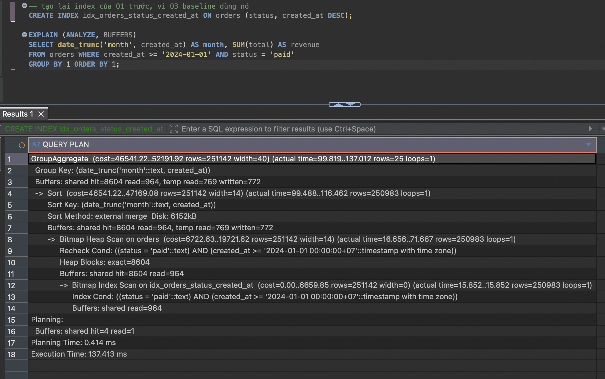
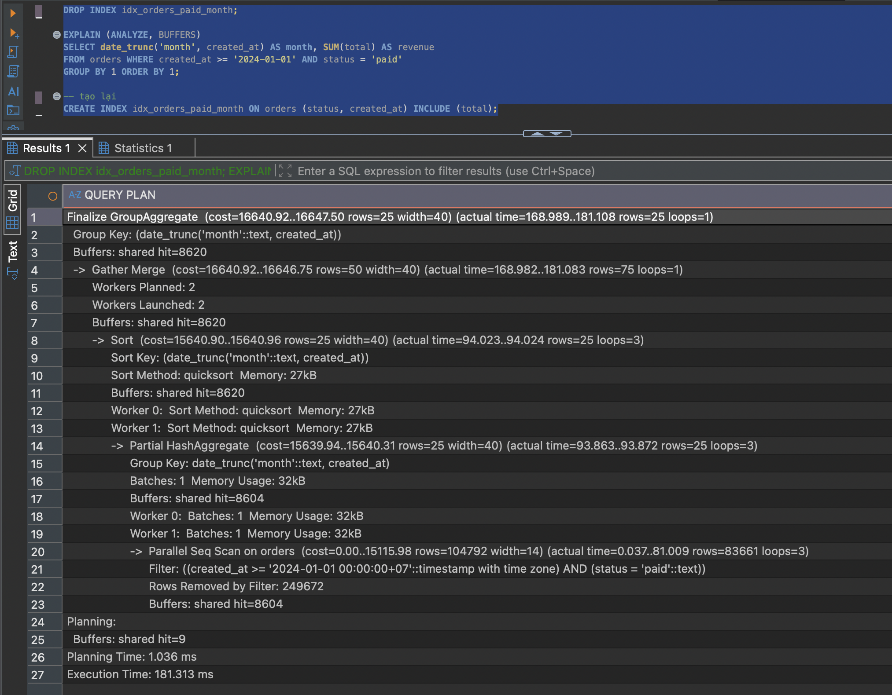
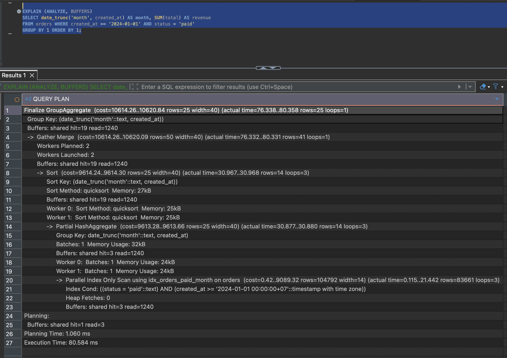

# Q3 — Doanh thu theo tháng

**153,4 ms → 21,4 ms** (thống kê 3,8× + covering index 1,9×)
[`before`](../plans/q3_before.txt) · [`chỉ thống kê`](../plans/q3_stage1_stats_only.txt) · [`after`](../plans/q3_after.txt)

Bài duy nhất mà index cần thiết đã có sẵn từ Q1 và planner đã dùng, mà vẫn chậm hơn cả
Q1 lúc chưa có index nào.

## Vấn đề

```
GroupAggregate  (rows=255108)  (actual rows=25)          <-- lệch 10.000 lần
  -> Sort  (rows=250983)  Sort Method: external merge  Disk: 6152kB
       -> Bitmap Heap Scan  Heap Blocks: exact=8604      <-- đọc gần hết bảng
```

- Dữ liệu trải từ 2024-08-25 nên `created_at >= '2024-01-01'` không lọc bỏ dòng nào. `WHERE` khớp 25,1% bảng — quá rộng để index có lãi (quy tắc: dưới ~5–10%).
- Ước lượng số nhóm lệch 10.000 lần vì **Postgres chỉ thu thập thống kê cho cột, không cho biểu thức**. Nó không biết `date_trunc('month', ...)` gộp 1 triệu giá trị thành 25 nhóm.
- Dây chuyền: tưởng 255.108 nhóm → HashAggregate vượt `work_mem` 4 MB → loại → Sort 250.983 dòng → 6152 kB vượt `work_mem` → đổ ra đĩa. Sort tốn 131/153 ms để tạo ra 25 dòng.
- Query này không cần sort dòng nào, chỉ cần bảng băm 25 ô.



## Sửa

Đo tách hai giai đoạn để biết công lao thuộc về đâu.

```postgresql
-- 1) dạy planner về biểu thức: 153,4 → 40,8 ms
CREATE STATISTICS stat_orders_month ON (date_trunc('month', created_at)) FROM orders;
ANALYZE orders;

-- 2) covering index để khỏi chạm bảng: 40,8 → 21,4 ms
CREATE INDEX idx_orders_paid_month ON orders (status, created_at) INCLUDE (total);
```

- Sau (1): ước lượng về đúng 25, HashAggregate được chọn, hết đổ đĩa. Planner còn bỏ luôn index và quay về Seq Scan — ở 25% thì quét tuần tự rẻ hơn thật.


- Sau (2): `Heap Blocks: exact=8604` thành `Heap Fetches: 0`. Query cần đúng 3 cột (`status` lọc, `created_at` lọc + gom nhóm, `total` cộng) nên `INCLUDE (total)` là đủ.
- Phần lớn cải thiện đến từ sửa thông tin cho planner, không từ index.



## Ghi chú

- `Index Only Scan` không đảm bảo không đọc bảng — phải nhìn `Heap Fetches`. Ở đây bằng 0 vì bảng nạp một lần rồi không sửa; trên bảng bị `UPDATE` liên tục con số này phồng lên.
- Giá: 41 MB trên bảng 67 MB. `idx_orders_status_created_at` (Q1) giờ là tiền tố của nó nên có thể đã thừa — chưa kiểm chứng.
- Đã loại: tăng `work_mem` (chữa triệu chứng, không chữa ước lượng sai); xoá mệnh đề ngày (đổi ngữ nghĩa khi có dữ liệu cũ hơn); bảng tổng hợp (thêm tầng đồng bộ, chưa cần ở 21 ms).
