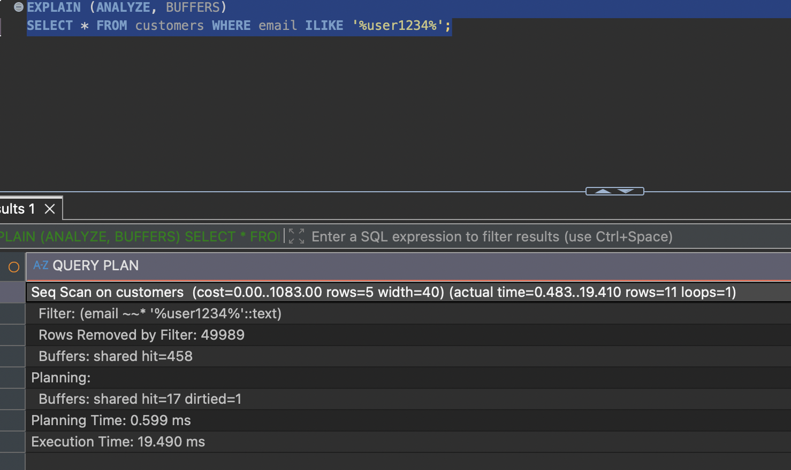
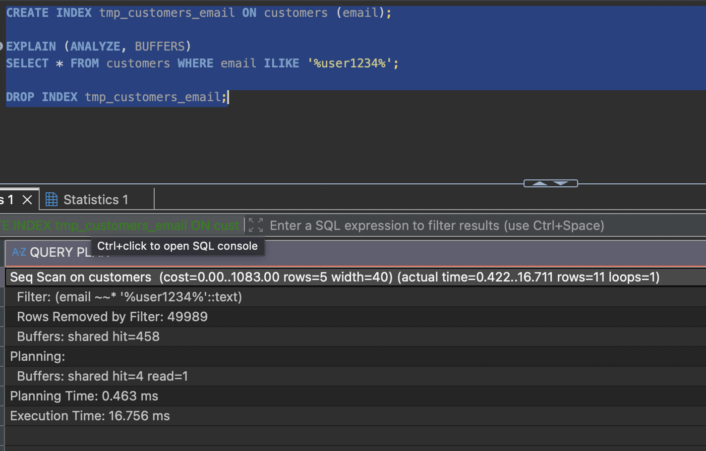
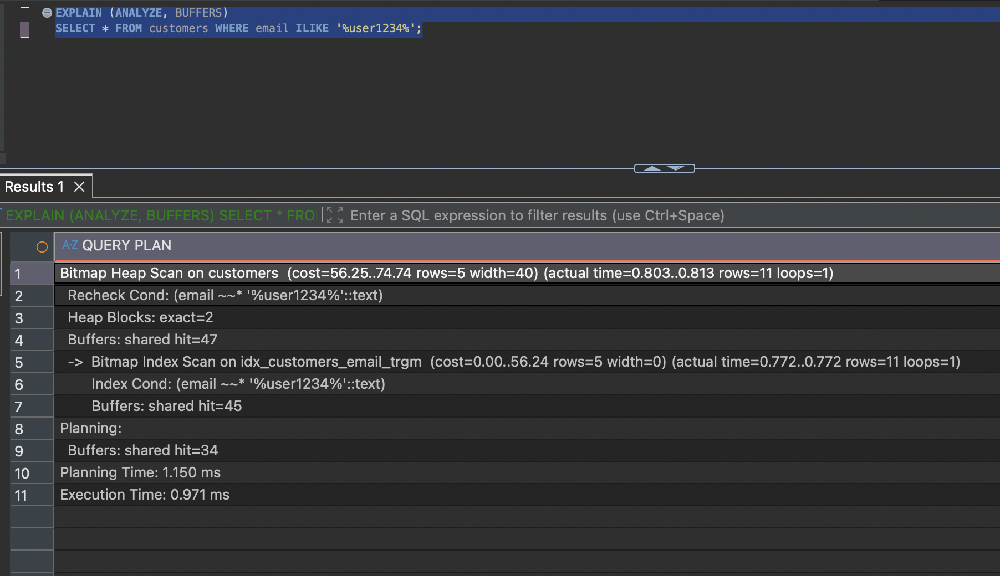
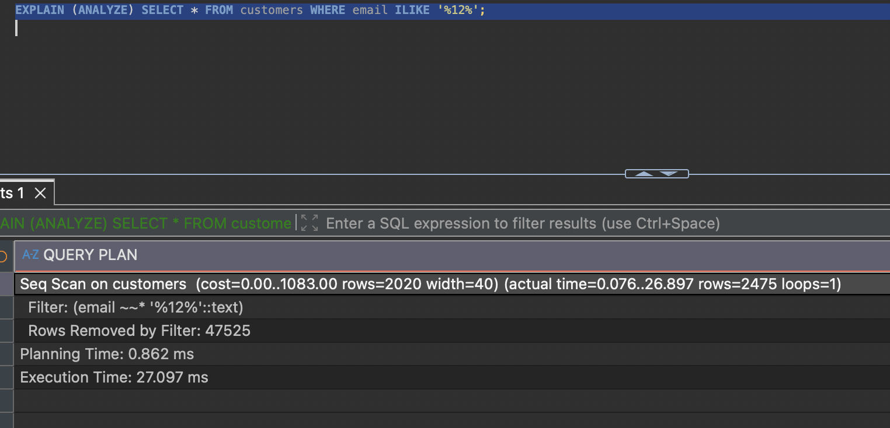

# Q4 — Tìm email bằng `ILIKE '%...%'`

**17,3 ms → 0,8 ms** · 458 → 47 block
[`before`](../plans/q4_before.txt) · [`after`](../plans/q4_after.txt)

## Vấn đề

```
Seq Scan on customers  (cost=0.00..1083.00 rows=5) (actual time=0.406..17.334 rows=11 loops=1)
  Filter: (email ~~* '%user1234%'::text)
  Rows Removed by Filter: 49989
```



- Thử tạo B-tree trên `email` trước: `cost` vẫn y hệt `0.00..1083.00` → planner không hề cân nhắc index đó. B-tree sắp chuỗi theo thứ tự chữ cái nên trả lời được "bắt đầu bằng X" nhưng không trả lời được "chứa X ở giữa". Giới hạn cấu trúc, không phải cấu hình.


- `ILIKE` thêm một tầng: thứ tự B-tree phân biệt hoa thường, nên ngay cả có tiền tố cũng cần `lower(email)` hoặc `text_pattern_ops`.
- Query khớp 11 dòng chứ không phải 1 — `%user1234%` khớp cả `user1234@` lẫn `user12340@`…`user12349@`. `LIKE '%...%'` không chỉ chậm mà còn sai ngữ nghĩa.

## Sửa

```postgresql
CREATE EXTENSION IF NOT EXISTS pg_trgm;
CREATE INDEX idx_customers_email_trgm ON customers USING gin (email gin_trgm_ops);
```

`pg_trgm` băm chuỗi thành mẩu 3 ký tự (`'user1234'` → `"  u"`, `" us"`, `"use"`, `"ser"`,
`"er1"`, `"r12"`, `"123"`, `"234"`) rồi GIN dựng chỉ mục ngược. Trigram ở giữa chuỗi tra
được như ở đầu, và `pg_trgm` chuyển hết về chữ thường nên `ILIKE` được xử lý luôn.

## Kết quả

```
Bitmap Heap Scan  Heap Blocks: exact=2
  Recheck Cond: (email ~~* '%user1234%')
  -> Bitmap Index Scan on idx_customers_email_trgm  rows=11
```

`Recheck Cond` ở đây bắt buộc về logic (khác Q2 nơi nó chỉ là chi tiết bitmap lossy):
GIN chỉ trả lời "chứa đủ các trigram này", chưa chắc đúng thứ tự — `1234user...` cũng
chứa đủ trigram của `user1234`. GIN là bộ lọc thô, không phải câu trả lời.



## Ghi chú

- Pattern dưới 3 ký tự thì index vô dụng: `ILIKE '%12%'` → Seq Scan, 21,8 ms.

  
- GIN ghi chậm hơn B-tree (~8 entry mỗi `INSERT` thay vì 1).
- Index 1904 kB trên bảng 3664 kB (52%) — nhỏ hơn bảng vì email mẫu quá đều, trigram của `@example.com` nằm ở cả 50.000 dòng nên GIN lưu một entry kèm danh sách nén. Trên email thật thường lớn hơn bảng. Phải tự đo.
- `rows=5` vs 11 thực tế: Postgres dùng hằng số phỏng đoán cho mọi `LIKE '%...%'`. Vô hại ở đây, nguy hiểm khi điều kiện như vậy nằm trong join lớn.
- Nếu yêu cầu thực chất chỉ là "bắt đầu bằng" thì B-tree trên `lower(email)` đủ và rẻ hơn nhiều.
