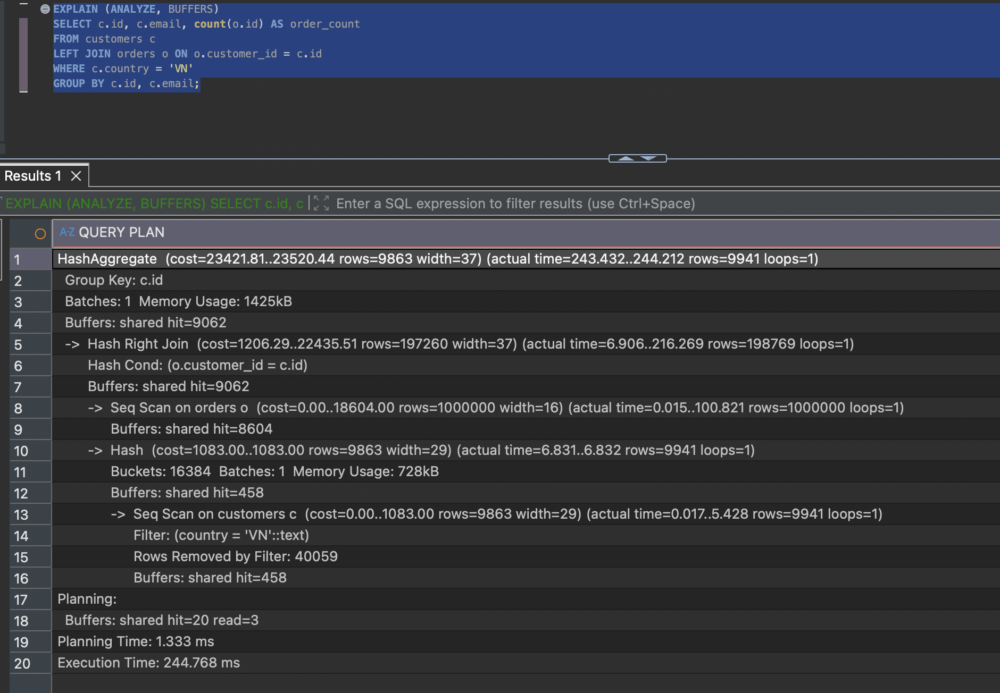
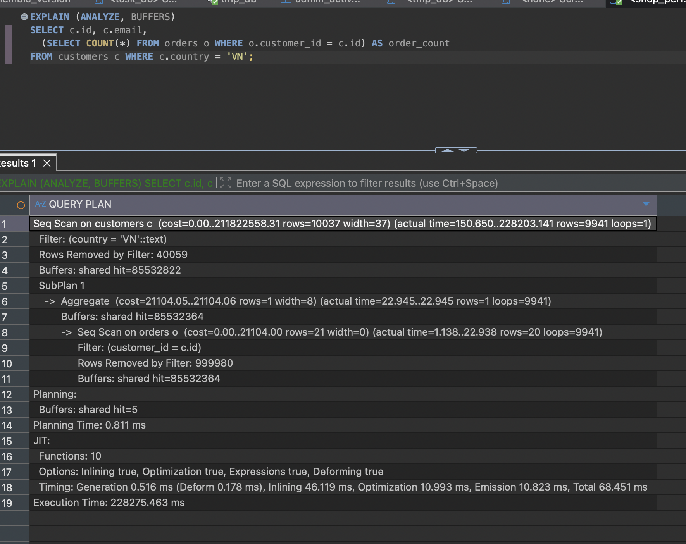

# Q5 — Correlated subquery đếm đơn hàng

**Không thay đổi gì.** 27,5 ms — cả ba phương án tối ưu đã thử đều làm chậm đi.
[`baseline`](../plans/q5_before.txt)

## Vì sao nó đã nhanh

```
Seq Scan on customers c   rows=9941
  SubPlan 1
    -> Index Only Scan using idx_orders_customer_id  (rows=20 loops=9941)
         Heap Fetches: 0
```

Subquery chạy 9.941 lần nhưng mỗi lần chỉ 0,004 ms — chỉ đọc index, không chạm bảng
`orders` lần nào (đếm thì không cần dữ liệu của dòng). Chỉ đúng vì
`idx_orders_customer_id` đã tạo ở Q2.

## Ba phương án đã thử

| | Thời gian | |
|---|---:|---:|
| **Giữ nguyên** | **27,5 ms** | |
| Index cho `customers.country` | 30,3 ms | 1,1× chậm hơn |
| [LEFT JOIN + GROUP BY](../plans/q5_rewrite_leftjoin.txt) | 186,8 ms | 6,8× chậm hơn |
| [Gom nhóm trước rồi join](../plans/q5_rewrite_preagg.txt) | 294,1 ms | 10,7× chậm hơn |

- **LEFT JOIN** phải quét sạch 1M dòng `orders` và tạo 198.769 dòng trung gian cho kết quả 9.941 dòng. Còn dễ sai hơn: phải `LEFT` (không thì mất khách chưa có đơn) và phải `count(o.id)` chứ không `count(*)` (không thì khách 0 đơn trả về 1).
- **Gom nhóm trước** đếm cho cả 50.000 khách rồi vứt 40.059 khách không phải VN.
- **Index `country`** khớp 19,9%, quá rộng — `Heap Blocks: exact=458`, đúng bằng cả bảng. Nút thắt nằm ở SubPlan 29.824 block, không ở khâu quét `customers` 458 block. Đã xoá.



## Đối chứng: bỏ index của Q2 ra

[`plans/q5_no_fk_index.txt`](../plans/q5_no_fk_index.txt)

```
-> Seq Scan on orders o  (rows=20 loops=9941)
     Rows Removed by Filter: 999980
Buffers: shared hit=85532822
JIT: Total 142.419 ms
Execution Time: 228254.517 ms
```

**3 phút 48 giây, chậm hơn 8.300 lần.** 9,9 tỉ dòng chạm vào, ~653 GB lưu lượng buffer.
Postgres bật cả JIT — thấy JIT trong plan là dấu hiệu query làm việc quá sức.



## Ghi chú

"Correlated subquery thì viết lại thành JOIN" bỏ qua điều kiện quyết định: subquery có
index để tra hay không. Cùng câu SQL, cùng dữ liệu, khác đúng một index: 27 ms vs
228.254 ms. Bốn plan của các thí nghiệm thất bại được giữ lại trong `plans/`.
