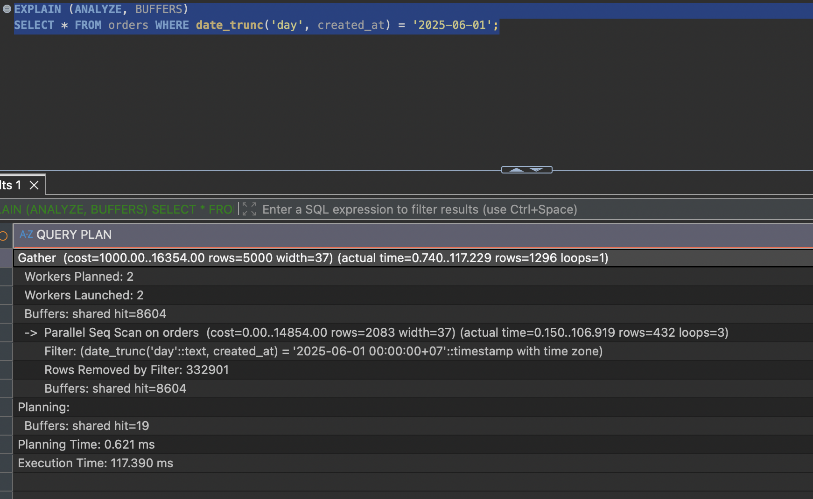
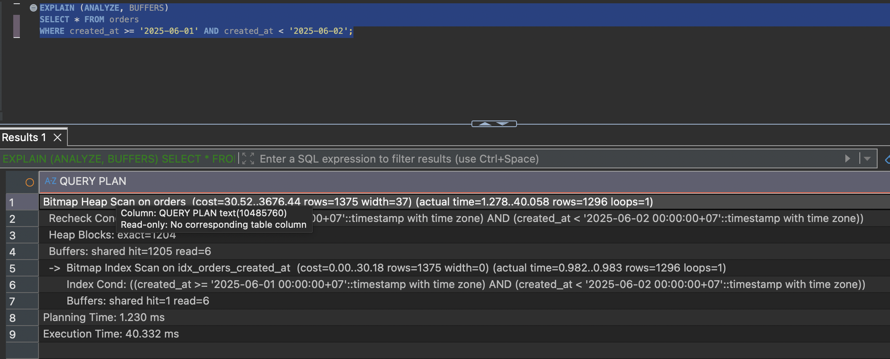
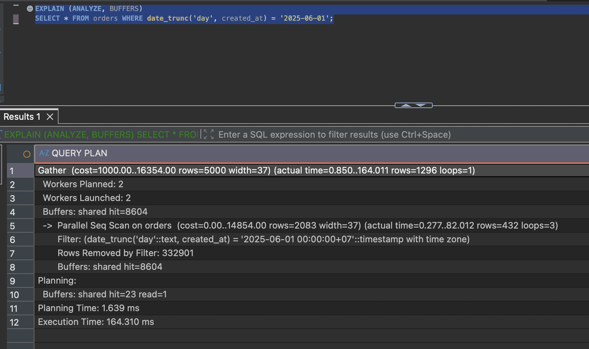
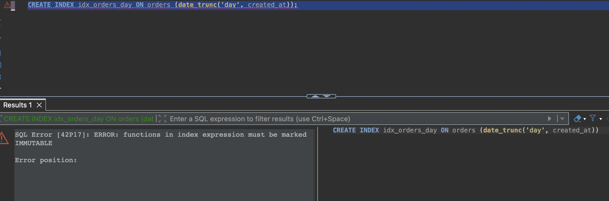

# Q6 — Hàm bọc lên cột làm hỏng index

**40,9 ms → 5,9 ms** · 8.604 → 1.226 block
[`before`](../plans/q6_before.txt) · [`after`](../plans/q6_after.txt)

Ngày `2024-06-01` của đề bài không có dòng nào (dữ liệu bắt đầu từ 2024-08-25) — query
trả về 0 dòng nhưng vẫn quét sạch 1 triệu. Số liệu dưới đây dùng `2025-06-01`, có 1.307
dòng thật.

## Vấn đề

```
Parallel Seq Scan on orders  (rows=436 loops=3)
  Filter: (date_trunc('day', created_at) = '2025-06-01')
  Rows Removed by Filter: 332898
```

- Khớp 0,13% bảng — mức chọn lọc lý tưởng cho index, vậy mà vẫn quét toàn bảng.
- `Filter` chứ không phải `Index Cond`: điều kiện so sánh **kết quả của hàm áp lên cột**, không phải cột. Index lưu giá trị `created_at`, không suy ra được `date_trunc('day', created_at)` nên phải tính hàm cho từng dòng. Thuật ngữ: **non-sargable**.
- Cùng bệnh: `EXTRACT(year FROM col) = 2025`, `UPPER(email) = '...'`, `total * 1.1 > 100`, `created_at::date = '...'`.



## Sửa

```postgresql
SELECT * FROM orders
WHERE created_at >= '2025-06-01' AND created_at < '2025-06-02';

CREATE INDEX idx_orders_created_at ON orders (created_at);
```

- Để cột đứng một mình một vế, đưa mọi phép tính sang vế kia.
- Dùng khoảng nửa mở thay `BETWEEN` — `BETWEEN ... AND '2025-06-01 23:59:59'` bỏ sót dòng rơi vào 23:59:59,5 (`TIMESTAMPTZ` chính xác tới micro giây).

## Kết quả

`Filter` thành `Index Cond`. Bitmap Index Scan chỉ đọc 7 block để xác định vị trí 1.307
dòng; 1.219 block còn lại là chi phí của `SELECT *`.



Bằng chứng quyết định — index đã tồn tại, chạy lại query cũ còn `date_trunc`:

```
Parallel Seq Scan on orders   Rows Removed by Filter: 333333
Execution Time: 42.081 ms
```



Có index trong tay mà không dùng được. Q1/Q2 là thiếu công cụ; ở đây công cụ đủ nhưng
câu hỏi đặt sai cách.

## Ghi chú

- Không tạo được index trên biểu thức: `ERROR: functions in index expression must be marked IMMUTABLE`. `date_trunc(text, timestamptz)` là STABLE vì kết quả phụ thuộc `TimeZone` của session.

  
- Bản 3 tham số `date_trunc('day', created_at, 'UTC')` thì IMMUTABLE và tạo index được, nhưng đã phải sửa query rồi thì sửa thành khoảng gọn hơn — mà lại phục vụ được mọi truy vấn khác trên `created_at` chứ không riêng theo ngày.
- Giá: index 21 MB trên bảng 67 MB.
